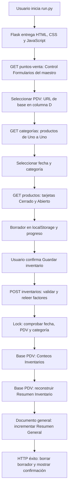

# Revisión de funcionamiento, datos y retiro de Apps Script

Actualización posterior de seguridad: el repositorio incorpora SSO WordPress RS256, sesión HS256 en cookie HttpOnly, 20 minutos de inactividad con varias pestañas y preparación inicial de Apache/Gunicorn, posteriormente sustituida por [Docker Compose y CI/CD](docs/GCP_DOCKER.md). En aquella fase pasaron **188 pruebas (82 anteriores + 106 nuevas)**; no se cambió lógica de inventario ni se escribió en Google o desplegó infraestructura. Documentación: [AUTENTICACION_SSO.md](docs/AUTENTICACION_SSO.md) y [VALIDATION.md](VALIDATION.md). Lo que sigue conserva el análisis funcional y la evidencia histórica previa.

Corrección sobre compat: `GOOGLE_FORMS_COMPAT_SCRIPT_ID` recibe el **Deployment ID del Ejecutable de API**, aunque el cliente instalado lo pase como `scriptId`. El ID local sigue vacío; al configurar el adaptador se requerirá consentimiento adicional del scope completo Forms, ausente del token actual. Para el inventario existente no es necesario regenerar OAuth. No se borró ni regeneró ningún token; ver [compat/README.md](compat/README.md).

La ampliación definitiva está en [docs/FUNCIONAMIENTO_SISTEMA.md](docs/FUNCIONAMIENTO_SISTEMA.md): los 35 destinos reales con Forms, la fila y pestañas de BC01, matrices de impacto, clasificación de archivos y un estado de retiro por cada proyecto original. BC01 se confirmó en la fila 2 y su base es el propio maestro.

Revisión del código presente en el workspace el 9 de septiembre de 2026. Se conservaron las modificaciones anteriores en README y la prueba del error de red. Esta tarea no modifica archivos de la aplicación, reglas de negocio, OAuth, scopes, IDs ni documentos de Google.

El servidor iniciado por el agente fue detenido. Las comprobaciones HTTP de esta revisión utilizan el test client de Flask: ejecuta las rutas dentro de un proceso que termina, sin abrir un puerto ni iniciar `run.py`. La regla de no dejar servidores está registrada en [AGENTS.md](AGENTS.md).

Los resultados medidos, su alcance y las comprobaciones todavía no ejecutadas están en [VALIDATION.md](VALIDATION.md). Las pruebas no certifican por sí solas el guardado en Google real ni la creación de formularios: ambas son escrituras y no se ejecutaron en esta revisión. El adaptador de Forms está incluido, pero `GOOGLE_FORMS_COMPAT_SCRIPT_ID` se encuentra vacío en la configuración local revisada.

## Flujo de la aplicación web



1. El usuario inicia `.\.venv\Scripts\python.exe run.py`. [run.py](run.py) construye la aplicación; [app/container.py](app/container.py) conecta servicios y repositorios. No lanza creación de PDV, actualización UDM ni reconstrucciones administrativas al arrancar. `GET /` entrega [index.html](app/templates/index.html), CSS y JavaScript.
2. El navegador pone la fecha local del día y llama `GET /api/puntos-venta`. [InventoryService.get_points_of_sale](app/services/inventory_service.py) lee el maestro mediante [MasterSheetRepository.control](app/repositories/master_sheet_repository.py). Conserva B no vacía, C con trim/uppercase igual a LISTO y D no vacía; hace trim del nombre, elimina duplicados y ordena con criterio español. No crea IDs de PDV.
3. Al seleccionar un PDV, `GET /api/categorias?pdv=...` resuelve su **nombre exacto** en Control Formularios y abre la URL de la columna D. Las categorías proceden de los productos de `Uno a Uno`, no de Google Forms. La búsqueda de la hoja tolera tildes, mayúsculas y los separadores contemplados por `utils.normalize`.
4. Al elegir fecha/categoría y comenzar, `GET /api/productos` devuelve id ordinal, categoría, item, producto, UDM y factor. El ordinal es temporal y no se guarda en Sheets. Encabezados y fallbacks A:D están en [inventory_service.py](app/services/inventory_service.py). El navegador recupera el borrador por item, muestra las tarjetas y filtra por item/nombre sin modificar Sheets.
5. Cada cambio de Cerrado o Abierto actualiza el array JavaScript y localStorage. El progreso considera completo un producto cuando ambos valores son distintos de cadena vacía. “Completar vacíos con 0” cuenta casillas, pide confirmación, escribe ceros en el navegador y actualiza borrador/progreso. Nada de esto envía inventarios a Google.
6. Al guardar, la UI exige ambos campos en todos los productos y pide confirmación. Envía `puntoVenta`, `fecha`, `categoria` y `conteos` con `categoria`, `item`, `producto`, `udm`, `cerrado`, `abierto`. No envía el factor como autoridad. Véase [inventory.js](app/static/js/inventory.js).
7. El backend exige selección y conteos, omite filas con ambas cantidades vacías, convierte un vacío individual en 0 y valida cantidades finitas no negativas. Genera un UUID común y la fecha/hora del servidor. Relee factores de la base PDV por item y calcula `Conteo Físico = Cerrado × Factor + Abierto`. Los textos item/producto/UDM se guardan desde el payload, como en el legacy; la categoría guardada es la selección del envío. No se registra nombre de operador en este flujo web.
8. Bajo el [bloqueo de archivo](app/services/locking.py), prepara el encabezado de Conteos, comprueba el duplicado **Fecha inventario + PDV normalizado + Categoría normalizada**, agrega las filas y ejecuta ambos resúmenes. El rechazo de duplicado ocurre después de preparar el encabezado, tal como en el original.
9. `Resumen Inventario` se reconstruye desde los Conteos del PDV. Agrupa por fecha, PDV normalizado e item; suma Cerrado/Abierto, conserva el primer factor y recalcula el físico del grupo.
10. `Resumen General` se actualiza incrementalmente: misma clave fecha/PDV/item; suma los nuevos Cerrado, Abierto y ConteoFisico a los anteriores. Actualiza descripción, UDM, factor y fecha de actualización con los del nuevo grupo. No equivale a recalcular toda la hoja en cada guardado. Ambas reglas están en [inventory_summary_service.py](app/services/inventory_summary_service.py).
11. Solo tras completar las tres escrituras responde éxito. Entonces la UI elimina el borrador y muestra confirmación. Ante error conserva el borrador y muestra el mensaje funcional; el traceback queda en el servidor. Sheets no ofrece aquí una transacción entre documentos: si falla un resumen después de escribir Conteos, esos conteos permanecen y un segundo envío puede ser rechazado como duplicado.

## Ubicación exacta de los datos

“Maestro” significa `1q34wHfO08PDclMA2zSNf03naVkSllG6lCRcHu6dGdg4`. “General” significa `1_Kj9mXyd5q8y1wx6D0sSmbapiGugvxj3yBo437xQk8M`. Se comprobaron los IDs de la configuración sin modificarlos. “Base PDV” es siempre la URL de Control Formularios columna D: puede ser el propio maestro para el PDV inicial; no se presupone un archivo separado por cada nombre.

| Dato | Dónde se guarda o se lee | Quién lo escribe |
|---|---|---|
| Lista de PDV, estado, URL de base, enlaces de Form, cantidad y detalle | Maestro → `Control Formularios`, A:I | Proceso de creación PDV; la aplicación web solo lo lee |
| Estado del proceso masivo | Maestro → `Control Formularios`, K1:L3 | Creación masiva: EN PROCESO, FINALIZADO, última revisión |
| Catálogo de categoría/item/producto/UDM/factor | Base PDV → `Uno a Uno` | Ya existe en Google; procede del XLSX convertido; UDM actualiza sus columnas correspondientes |
| Selección, productos cargados, búsqueda y progreso | Memoria JavaScript del navegador | JavaScript; no es persistencia de negocio |
| Borrador | localStorage del navegador y origen actual | `guardarBorrador`: array de `{item, cerrado, abierto}` |
| Conteo confirmado por la app | Base PDV → `Conteos Inventarios`, A:L | `InventoryService.save_inventory` |
| Resumen del PDV | Misma base → `Resumen Inventario`, A:J | `InventorySummaryService.update_pdv_summary` |
| Consolidado de PDV | Documento general → `Resumen General`, A:J | Guardado incremental o reconstrucción administrativa |
| Maestro de UDM | Maestro → `Base de datos UDM`, se leen A:E desde fila 2 | Fuente ya existente; la app no la reemplaza |
| Resultado de actualización UDM | Maestro → `Registro actualización UDM`, A:F | `UdmService.update_all` |
| Enlaces y fecha del Form de un PDV | Base PDV → `Configuración`, A1:B4 | `PdvCreationService.process_next_pdv` |
| XLSX originales, Sheets convertidos y Forms nuevos | Carpeta Drive padre del maestro | Conversión y movimiento mediante Drive API; no se elimina el XLSX |
| Respuestas enviadas por Google Forms | En el Form y su destino de respuestas vinculado en la base PDV | Google Forms; no pasan por POST `/api/inventarios` |
| Cliente OAuth y token de usuario | Rutas `GOOGLE_CREDENTIALS_PATH` y `GOOGLE_TOKEN_PATH`; predeterminadas `credentials/credentials.json` y `credentials/token.json` | Cliente descargado/configurado por el usuario; token generado/renovado por OAuth |
| IDs, huso y rutas de configuración | `.env` o variables de entorno | Configuración de ejecución; no contiene los inventarios |
| Bloqueos | `INVENTORY_LOCK_PATH`, predeterminado `.runtime/inventory.lock`, y `.creation` | filelock; no guarda registros de inventario |
| Errores y trazas | stdout/stderr del proceso que ejecuta Flask o el comando | logging; no hay archivo de log configurado por la app |

La clave de borrador es exactamente `inventario-uno-a-uno-v3-{PDV}-{FECHA}-{CATEGORIA}`. No guarda factor, nombre del producto ni UDM. Tampoco sincroniza entre dispositivos, navegadores u orígenes; un borrador del dominio de Apps Script no aparece automáticamente en localhost.

Los encabezados de `Conteos Inventarios`, en orden, son:

```text
ID Registro | Fecha y hora | Fecha inventario | Punto de venta | Categoría | Item
Nombre Producto | Desc. U.M. | Cerrado | Abierto | Factor | Conteo Físico
```

Los encabezados de ambos resúmenes son:

```text
Fecha inventario | Punto de venta | Item | Descripcionproducto | UDM
Cerrado | Abierto | Factor | ConteoFisico | Última actualización
```

En Control Formularios A:I se guardan `ID archivo`, `Punto de venta`, `Estado`, `Base Google Sheets`, `Formulario para responder`, `Formulario para editar`, `Productos`, `Fecha`, `Detalle`. El ID de archivo es el del XLSX; el UUID de envío es otro concepto y solo se usa en Conteos. Los nombres exactos están en [constants.py](app/constants.py).

## Operaciones administrativas separadas de la UI

Los [scripts administrativos](scripts/_bootstrap.py) piden `EJECUTAR` o `--confirm`. No se ejecutan desde la pantalla de inventario ni por una tarea programada incluida en Python.

- **Crear PDV:** [create_all_pdv.py](scripts/create_all_pdv.py) llama [PdvCreationService](app/services/pdv_creation_service.py). Determina la carpeta padre, registra BC01 si corresponde, marca EN PROCESO y elige el primer XLSX no registrado cuyo nombre no sea el del maestro. Registra PROCESANDO, convierte en Google, espera 3 segundos, lee A:D de Uno a Uno y filtra Item/Producto vacíos. Crea el Form, mueve el archivo, limpia Configuración y escribe enlaces/fecha; marca LISTO o ERROR. Espera 60 segundos antes del siguiente ciclo. IDs ya registrados, incluidos ERROR/PROCESANDO, no se reprocesan. No crea triggers Apps Script ni usa ScriptProperties; mantiene el ciclo en un proceso Python que debe seguir vivo hasta finalizar.
- **Actualizar UDM:** [update_all_udm.py](scripts/update_all_udm.py) llama [UdmService](app/services/udm_service.py). Del maestro UDM usa B para nombre normalizado, C para descripción y D para factor; procesa bases LISTO. Detecta/crea Desc. U.M. y Factor U.M. en Uno a Uno, actualiza coincidencias y conserva valores sin coincidencia. Registra fecha, PDV, estado, actualizados, cantidad sin coincidencia y los primeros 20 nombres separados por ` | `. No recalcula automáticamente Conteos ni resúmenes.
- **Reconstruir general:** [rebuild_general_summary.py](scripts/rebuild_general_summary.py) lee Conteos de todas las bases LISTO, recalcula físicos por fila, agrupa y finalmente limpia/reemplaza Resumen General. No modifica Conteos ni reconstruye Resumen Inventario. Los fallos de lectura impiden llegar a la limpieza final.

## Google Forms y dependencia residual de Apps Script

[GoogleFormsService](app/services/google_forms_service.py) crea título, descripción, publicación y preguntas mediante REST. El formulario conserva una pregunta de nombre, una fecha y una cantidad no negativa por producto, agrupada en secciones. Este Form **no contiene el mismo par Cerrado/Abierto de las tarjetas Flask**: así está definido también en `legacy/CrearTodosPDV.gs`.

Después Python llama [FormsCompatibilityAdapter.configure](app/services/forms_compatibility_adapter.py), que ejecuta mediante `scripts.run` la función `configurarCompatibilidadInventario(formId, spreadsheetId)` del [adaptador incluido](compat/forms_adapter.gs). Este aplica confirmación, barra de progreso, validación numérica y destino del Form; devuelve enlaces de respuesta y edición. No lee ni escribe las hojas de Conteos/resúmenes, y no procesa envíos de los usuarios.

El código real no contiene `onFormSubmit`, suscripción a respuestas ni importación desde la pestaña de respuestas de Forms hacia `Conteos Inventarios`. Los resúmenes descritos arriba leen exclusivamente Conteos. Por tanto, no se debe asumir que responder un Google Form actualiza estos resúmenes mediante Flask. Si existe un script remoto que hace ese trabajo, su fuente no está en este workspace y debe revisarse antes de retirarlo.

El ID del adaptador está vacío en el `.env` revisado. La creación masiva llama `check_configured()` antes de escribir: **actualmente no puede completar la creación de nuevos PDV desde Python hasta configurar y validar ese adaptador**. Leer Forms existentes no demuestra que `scripts.run` esté desplegado ni autorizado.

## Qué scripts se pueden retirar

Aquí “retirar” significa dejar de ejecutar/publicar una función sustituida, conservando una copia de su fuente. No se ha eliminado ni despublicado nada. La decisión de retirar todo un proyecto remoto requiere conocer sus despliegues/triggers reales; el workspace no los inventaría.

| Componente original o actual | Dependencia en el código Python | Dictamen |
|---|---|---|
| Web App original: el `Código.gs` representado por `legacy/Codigo.gs` y su `Index.html` | La UI y las operaciones están en Flask; Python no llama `doGet`, `obtenerProductos` ni `guardarInventario` del proyecto original | Sustituido en código. Puede desactivarse su despliegue cuando se complete la aceptación real del guardado y el nuevo servicio esté disponible para sus usuarios. La revisión de solo lectura no acredita todavía ese guardado. |
| `actualizarTodasLasBasesUDM` y `reconstruirResumenGeneral` presentes en esa copia | Reemplazados por los dos comandos Python | Sustituidos en código y probados con mocks/referencia legacy. Retirar su ejecución original cuando se valide la operación administrativa correspondiente con datos autorizados. |
| `CrearTodosPDV.gs` | Reemplazado por el comando Python; este no invoca las funciones originales | Todavía no retirar como alternativa operativa: la creación Python depende del adaptador sin configurar y no se ha probado creando un PDV real. Tras validarla, se puede dejar de ejecutar el original. |
| Trigger original de `procesarSiguientePDV` | Python usa un bucle y espera; no necesita ese trigger | Puede deshabilitarse al cambiar al comando Python, verificando antes que no haya una creación original en curso. No se deshabilitó durante esta revisión. |
| Otro `Código.gs` del proyecto de Automatización | No hay una copia separada identificable en `legacy/`; solo están `Codigo.gs`, `CrearTodosPDV.gs` e `Index.html` | No se puede certificar su retiro ni afirmar que está migrado si contiene funciones adicionales. Revisar su fuente real y sus triggers. |
| Proyecto sin título, confirmado vacío por el usuario en la ampliación documental | No aparece referenciado en el código revisado | Se puede retirar ahora basándose en esa confirmación. No se inspeccionó ni borró remotamente. Otros proyectos no suministrados no están cubiertos por este dictamen. |
| `compat/forms_adapter.gs` | Llamada explícita a `configurarCompatibilidadInventario` desde Python | Sigue siendo necesario para crear nuevos PDV con el comportamiento actual de Forms. Si se aloja dentro de un proyecto original, ese proyecto/despliegue debe conservarse. |
| Archivos bajo `legacy/` del repositorio | Los usa la suite de comparación; Flask no los ejecuta | Conservarlos como referencia y para las pruebas. Retirar un despliegue de Google no significa borrar estas copias. |

El adaptador solo es necesario al configurar nuevos Forms. El flujo cotidiano de inventario para bases existentes no lo invoca. No se necesita mantener activo el Web App original únicamente para que Flask lea/escriba sus mismos Sheets; sí se deben conservar los documentos Google y el acceso de la cuenta OAuth.

La ejecución predeterminada es local (`127.0.0.1`). No sustituye la disponibilidad del antiguo enlace de Apps Script para los demás usuarios del PDV. Antes de retirar ese despliegue debe existir una ubicación accesible del nuevo servicio y haberse aceptado su guardado; no se desplegó infraestructura en esta revisión.

## Qué se conserva y qué falta aceptar

Se comprobaron la fórmula de físico, prioridad X número, normalización histórica por 10000, duplicados, UUID por envío, encabezados y la diferencia entre acumulación de ambos resúmenes. Las pruebas ejecutan funciones del Apps Script original con hojas simuladas y comparan los resultados con Python. El CSS y cuerpo HTML coinciden automáticamente con la copia original; los flujos de localStorage se prueban con DOM simulado.

Se conserva incluso que la ausencia de columna Factor hace que el mapa usado al guardar quede vacío y termine usando 1; y que la posición del factor mostrado en productos se aplica después de filtrar filas, como en el original. El código endurece únicamente cantidades no finitas y escritura literal de textos, ya documentados en la primera migración.

No se afirma paridad integral en producción: faltan una aceptación de guardado real con ambos resúmenes, una ejecución real autorizada de UDM/reconstrucción, la creación completa de un PDV/Form con adaptador y la inspección de posibles scripts/triggers remotos no suministrados. No se hicieron estas escrituras como parte de una revisión de solo lectura.
