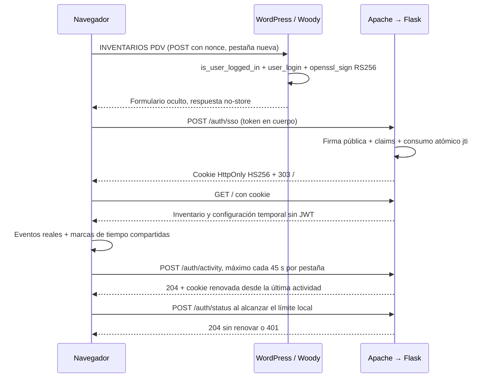

# WordPress SSO y sesión de Inventarios PDV

Esta capa protege HTTP sin cambiar inventario, Google OAuth, endpoints existentes o el contenido de los borradores. WordPress es la autoridad de identidad; Flask no tiene usuarios, contraseñas ni base de datos adicional.

## Tokens y validación

[deploy/woody_sso_snippet.php](../deploy/woody_sso_snippet.php) se registra como snippet PHP que se ejecuta en todas partes, incluyendo `admin-post.php`. Su shortcode `[inventarios_pdv_sso]` muestra el botón solo a usuarios autenticados. La intranet conserva el control de visibilidad; no se inventan roles. El primer POST a WordPress abre `target="_blank"`, verifica login y nonce de WordPress y firma en ese momento. El formulario oculto posterior envía el token a Flask dentro de **esa misma pestaña nueva**, mediante `target="_self"`; no abre una segunda ventana ni depende de un popup automático. Así el JWT no caduca por dejar abierta la página de intranet antes de pulsar el botón.

La clave privada RSA se lee exclusivamente en WordPress desde `/etc/calco-intranet/inventario-uno-a-uno/sso_private.pem`. `openssl_sign(..., OPENSSL_ALGO_SHA256)` firma header/payload codificados Base64URL sin relleno. `random_bytes(32)` crea `jti`; no se usa Composer. El JWT solo se serializa en el `input hidden` requerido por el protocolo; no se muestra como texto, no se pone en la URL ni se registra. Si falta la clave, falla con un mensaje genérico. Las respuestas de transferencia tienen `no-store`, `no-referrer` y CSP con nonce.

Flask utiliza [PyJWT con soporte criptográfico](https://pyjwt.readthedocs.io/en/stable/api.html). Los algoritmos están fijados separadamente: SSO acepta **solo RS256**, y sesión **solo HS256**. Valida firma, `typ=JWT`, claims obligatorios, issuer, audience exacta, subject no vacío, fechas enteras y consistentes y `jti` válido. Rechaza `none`, otras firmas/algoritmos, claims ausentes y fechas fuera de ventana. Vida SSO máxima predeterminada: 60 s; tolerancia máxima de reloj: 10 s. El TTL de cada `jti` consumido es el mayor entre 90 s desde su consumo y el vencimiento del token más tolerancia. Comprobar y consumir ocurre bajo un lock de threads.

`POST /auth/sso` solo toma `request.form['token']`, rechaza query string y JSON y redirige a `/` con 303. No acepta `?usuario=` como identidad. El JWT WordPress nunca se reutiliza como sesión.

## Sesión e inactividad

El JWT interno contiene `iss`, `aud`, `sub`, `iat`, `exp`, `sid` UUID y `act` (última actividad aceptada). `SESSION_JWT_SECRET` es independiente de RSA y de OAuth, con al menos 32 bytes aleatorios; genere 32 bytes con `openssl rand -hex 32`. La aplicación rechaza claves vacías/cortas o manifiestamente repetitivas; la aleatoriedad debe garantizarla la generación, no puede deducirse completamente de una cadena.

Cookie predeterminada **`inventario_session`**: `HttpOnly`, `SameSite=Lax`, `Path=/`, sin `Domain`, `Secure` obligatorio en producción, `Max-Age` igual al tiempo restante. Su JWT no aparece en HTML, JavaScript, URL, localStorage ni sessionStorage. En HTML y cabeceras solo se entregan tiempos y un hash del `sid` para correlacionar pestañas, que no permite autenticarse.

`exp = act + SESSION_IDLE_TIMEOUT_SECONDS`, por defecto **1200 s**. No hay vencimiento fijo desde el login: actividad a las 14:10, 14:25 y 14:44 mantiene la sesión; con última actividad a las 14:44 vence a las 15:04. PyJWT comprueba `exp` en cada ruta protegida sin tolerancia adicional para la sesión. Un token ya vencido siempre recibe 401, aunque se manipule JavaScript o se intente `/auth/activity`.

[auth.js](../app/static/js/auth.js) escucha `click`, `keydown`, `input`, `scroll`, `touchstart`, `mousemove` y descarta eventos sintéticos. Mantiene la última actividad en memoria y publica como máximo una marca compartida por segundo. Revisa cada 5 s y envía heartbeat como máximo cada 45 s por pestaña **solo si hubo actividad sin confirmar**. El primer evento tras una pausa puede enviarlo inmediatamente. Envía `idle_seconds`, tiempo transcurrido desde el evento, para que el backend lo descuente al calcular `act`; esperar al siguiente heartbeat no concede 45 s adicionales de sesión. Las peticiones API, healthchecks y consultas de estado no generan actividad ficticia ni renuevan cookies automáticamente.

La UI muestra el cierre en la primera revisión tras el límite (hasta unos 5 s con la pestaña activa; los navegadores pueden suspender temporizadores en segundo plano). El servidor aplica el vencimiento en todas las solicitudes incluso mientras el navegador está suspendido. Sin red no se renueva; al vencer el límite local se muestra la pantalla de expiración. No hay recuperación automática de un JWT vencido.

## Varias pestañas y borradores

Se comparten exclusivamente claves `inventario-auth-v1-{contexto}-activity` y `inventario-auth-v1-{contexto}-ack`, con timestamps; se usa el evento `storage`. Se conserva el mayor timestamp observado. Antes de cerrar por su reloj local, una pestaña consulta **`POST /auth/status`**, que valida la cookie compartida y devuelve sus tiempos **sin renovarla**. Esto también cubre una pestaña suspendida o localStorage deshabilitado. Una pestaña inactiva no hace logout ni elimina cookies y un 401 antiguo no envía `Set-Cookie` para borrar una cookie más reciente.

Ante expiración se detienen heartbeats y se navega a `/auth/expired`, con el texto «Sesión cerrada por inactividad. Ingrese nuevamente desde la intranet.». El script de autenticación no usa `removeItem` ni `clear`. Conserva exactamente `inventario-uno-a-uno-v3-{PDV}-{FECHA}-{CATEGORIA}` y su contenido. Tras reingresar desde la intranet, elegir el mismo PDV/fecha/categoría ejecuta `recuperarBorrador()` existente. Solo el guardado exitoso elimina ese borrador, como antes. Los borradores siguen perteneciendo al navegador y origen; no se trasladan entre dominios.

`POST /auth/logout` requiere sesión válida, elimina la cookie y conserva borradores. Está disponible además como `window.inventoryAuth.logout()` para una integración de UI explícita. Se conserva el cuerpo visual del inventario original, por lo que no se añadió un botón de logout a esa pantalla. Las otras pestañas detectan la ausencia de cookie en su siguiente solicitud. La sesión JWT es stateless: borrar la cookie no revoca una copia extraída previamente; ante una exposición del secreto se debe rotar el secreto, invalidando todas las sesiones.

## Rutas y CSRF

| Ruta | Acceso / efecto |
|---|---|
| `POST /auth/sso` | Público, exclusivamente formulario firmado y de un uso; crea cookie |
| `GET /healthz` | Público, `200 {"status":"ok"}`, no consulta Google |
| `GET /auth/expired` | Público, pantalla de acceso con estado 401; no borra cookie |
| `POST /auth/activity` | Sesión válida y protección CSRF; renueva; 204 |
| `POST /auth/status` | Sesión válida y protección CSRF; consulta sin renovar; 204 |
| `POST /auth/logout` | Sesión válida y protección CSRF; borra cookie; 204 |
| `/`, `/api/*`, recursos estáticos y cualquier otra ruta | Protegidos por defecto cuando AUTH_ENABLED=true |

API sin sesión: `401 {"correcto":false,"mensaje":"Sesión expirada. Ingrese nuevamente desde la intranet."}`. HTML sin sesión: «Acceso requerido. Ingrese a Inventarios PDV desde la intranet.». Solo se muestra enlace si `INTRANET_URL` está configurada y es HTTP(S) válida (HTTPS en producción). No hay CORS ni endpoints de login Google de usuarios.

Las mutaciones autenticadas exigen `X-Requested-With: InventariosPDV`, verifican `Origin` si existe y rechazan `Sec-Fetch-Site: cross-site`. El wrapper de fetch lo añade a los endpoints API sin alterar su payload. El SSO tiene su validación criptográfica independiente y permite el POST desde WordPress. No se utiliza una cookie Flask de sesión adicional ni un token CSRF guardado en localStorage.

## Variables y límites de operación

Todos los valores están en [.env.example](../.env.example). Desarrollo puede ejecutarse sin WordPress con `APP_ENV=development`, `AUTH_ENABLED=false`, `SESSION_COOKIE_SECURE=false`. La ausencia de esas variables locales conserva esos defaults; el `.env` privado existente no fue sobrescrito.

| Variable | Predeterminado / validación |
|---|---|
| `APP_ENV` | `development`; admite también `testing` y `production` |
| `AUTH_ENABLED` | `false`; obligatorio true en producción |
| `SSO_ISSUER` / `SSO_AUDIENCE` | `calco-intranet` / `inventarios-uno-a-uno` |
| `SSO_PUBLIC_KEY_PATH` | Vacío; obligatorio con autenticación, archivo público RSA PEM >=2048 bits |
| `SSO_TOKEN_MAX_AGE_SECONDS` | 60, entero 1–300; coordinar con TTL WordPress |
| `SSO_CLOCK_SKEW_SECONDS` | 10, entero 0–10 |
| `SESSION_JWT_SECRET` | Vacío; independiente, mínimo 32 bytes aleatorios |
| `SESSION_JWT_ISSUER` / `SESSION_JWT_AUDIENCE` | `inventarios-uno-a-uno` / `inventarios-session` |
| `SESSION_JWT_COOKIE_NAME` | `inventario_session` |
| `SESSION_IDLE_TIMEOUT_SECONDS` | 1200, entero 60–86400 |
| `SESSION_COOKIE_SECURE` | false local; true obligatorio en producción |
| `INTRANET_URL` | Vacío; enlace opcional, nunca URL inventada |

Producción rechaza autenticación desactivada, cookie insegura, debug activo, secreto insuficiente, ruta pública ausente/inexistente, PEM privada/no RSA y configuración JWT inválida. La configuración se valida antes de construir servicios Google.

**Un solo worker y una sola instancia**: el replay cache es memoria compartida entre los cuatro threads del proceso. Varios workers, varios servidores o un reemplazo gradual con procesos simultáneos exigirían un cache compartido; no se incorporaron Redis ni almacenamiento externo. Un reinicio pierde los `jti` consumidos: para mantenimientos planificados deshabilite temporalmente el acceso Woody y deje transcurrir al menos `max(90, SSO_TOKEN_MAX_AGE_SECONDS + 2 × SSO_CLOCK_SKEW_SECONDS)` antes de volver a permitir SSO. No utilice `--reload`, escalado automático ni recargas con workers superpuestos. El lock de inventario existente sigue siendo un archivo compartido por aplicación y CLI; Apps Script no participa en él.

En producción [LocalProxyFix](../app/controllers/auth_controller.py) aplica exactamente un salto de `X-Forwarded-For` y `X-Forwarded-Proto`, únicamente si el peer real es `127.0.0.1` o `::1`. Ignora forwarded host/port/prefix; Host viene de Apache con `ProxyPreserveHost`. [Flask documenta la necesidad de limitar los proxies confiables](https://flask.palletsprojects.com/en/stable/deploying/proxy_fix/). Apache elimina cabeceras forwarded aportadas por el cliente y Gunicorn solo escucha en loopback. No añadir otro proxy sin revisar ambos lados.

Google OAuth sigue separado en `GoogleAuthService`: su token autoriza las APIs de Google y puede renovarse en su archivo. El usuario WordPress no lo sustituye. La corrección del ID del adaptador y el consentimiento adicional de Forms están en [compat/README.md](../compat/README.md).
