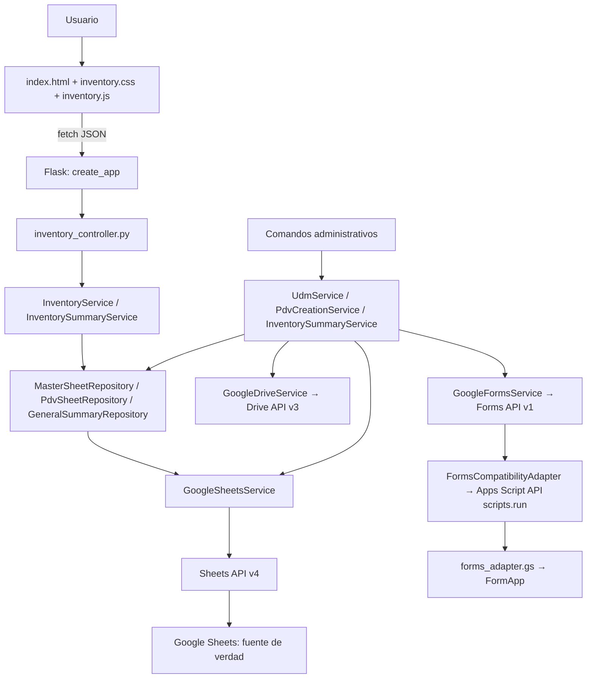
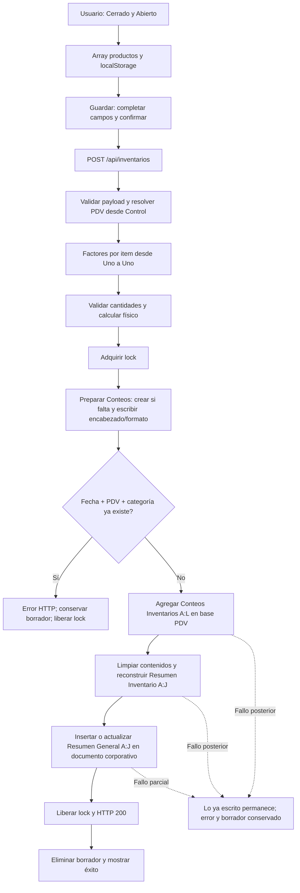

# Funcionamiento de Inventario Uno a Uno

Revisión del 9 de septiembre de 2026. Documento basado en el código actual del workspace y en lecturas autorizadas de Google. No se guardaron inventarios, no se ejecutaron comandos administrativos, no se crearon Forms y no se modificaron documentos Google. No se inició un servidor Flask para esta revisión. No hubo cambios funcionales ni refactors.

## Objetivo y alcance de la validación

Python/Flask sustituye la interfaz y las operaciones del Apps Script suministrado, conservando Google Sheets como almacenamiento. No existe MySQL, PostgreSQL, SQLite ni una base de datos propia. Los repositorios son clases que acceden a Sheets, no bases locales.

La revisión anterior del mismo día dejó 82 pruebas aprobadas y lecturas reales satisfactorias de los 35 PDV: 5580 filas de productos, factores devueltos positivos, BC01 con 159 productos y ocho categorías. Son evidencias de pruebas locales y de lectura; no certifican un guardado real. Esta ampliación documental volvió a leer Control Formularios y metadatos mediante cuatro GET de Sheets, con rechazo de cualquier método de escritura en el verificador puntual. No se repitió la suite completa porque esta tarea prohíbe POST, incluso durante su explicación. Véase [VALIDATION.md](../VALIDATION.md).

La correspondencia función por función está en [MIGRATION_PARITY.md](../MIGRATION_PARITY.md). Quedan pendientes la aceptación autorizada de escrituras reales, la creación completa con adaptador y la revisión de código/triggers remotos no suministrados. No debe interpretarse «migrado en código» como «aceptado íntegramente en producción».

## Documentos y configuración efectivos

| Papel | Nombre real | ID | URL |
|---|---|---|---|
| Maestro y también base de BC01 | BC01 - Cocina Envigado | `1q34wHfO08PDclMA2zSNf03naVkSllG6lCRcHu6dGdg4` | [Abrir maestro / BC01](https://docs.google.com/spreadsheets/d/1q34wHfO08PDclMA2zSNf03naVkSllG6lCRcHu6dGdg4/edit) |
| Resumen corporativo | Resumen General Inventarios PDV | `1_Kj9mXyd5q8y1wx6D0sSmbapiGugvxj3yBo437xQk8M` | [Abrir resumen corporativo](https://docs.google.com/spreadsheets/d/1_Kj9mXyd5q8y1wx6D0sSmbapiGugvxj3yBo437xQk8M/edit) |

Se comprobó que `.env` y la configuración efectiva coinciden en ambos IDs. [app/config.py](../app/config.py), `settings()`, carga `.env`; las variables ya existentes del proceso tienen prioridad porque `load_dotenv` no las sobrescribe. [app/container.py](../app/container.py), `build_services()`, pasa los IDs a `MasterSheetRepository` y `GeneralSummaryRepository`.

Python envía `spreadsheetId` a la API y selecciona pestañas por título. No abre la URL legacy `.../edit?gid=1323363823#gid=1323363823` ni usa ese `gid` para elegir la hoja de control. Esa URL apunta al mismo documento maestro. Para otros PDV extrae el ID de la URL almacenada en D mediante `app.utils.spreadsheet_id`; acepta también un ID directo. La URL de cada base no está fijada en código.

`APP_TIMEZONE=America/Bogota` rige el reloj del backend y las claves de fecha. La fecha inicial del formulario web se toma del navegador. Los seriales de fecha de Sheets se interpretan en el huso de cada documento; las claves se forman en el huso configurado del backend.

En el maestro se usan `Control Formularios` (directorio de PDV), `Base de datos UDM` (fuente de actualización) y `Registro actualización UDM` (bitácora administrativa). Como también es BC01, se usan allí `Uno a Uno`, `Conteos Inventarios`, `Resumen Inventario` y, en el registro inicial de BC01, `Configuración`. Todas estas pestañas existen actualmente. La actualización UDM puede crear la bitácora si falta.

## ¿Dónde se guarda un inventario?

Ejemplo real: **BC01 - Cocina Envigado**.

1. Se consulta el [maestro](https://docs.google.com/spreadsheets/d/1q34wHfO08PDclMA2zSNf03naVkSllG6lCRcHu6dGdg4/edit), pestaña `Control Formularios`.
2. BC01 está en la **fila 2**, estado `LISTO`.
3. Su celda **D2** contiene exactamente: https://docs.google.com/spreadsheets/d/1q34wHfO08PDclMA2zSNf03naVkSllG6lCRcHu6dGdg4/edit
4. Por tanto, el documento destino del detalle es **el propio maestro**, ID `1q34wHfO08PDclMA2zSNf03naVkSllG6lCRcHu6dGdg4`.
5. El detalle se agrega a `Conteos Inventarios`, columnas **A:L**. El resumen local se reconstruye en `Resumen Inventario`, columnas **A:J**.
6. Después se actualiza el [documento corporativo](https://docs.google.com/spreadsheets/d/1_Kj9mXyd5q8y1wx6D0sSmbapiGugvxj3yBo437xQk8M/edit), pestaña `Resumen General`, columnas **A:J**.

Son dos documentos físicos para este guardado, no tres: maestro y base BC01 coinciden. Guardar BC01 no cambia `Control Formularios`, `Base de datos UDM` ni `Configuración`; cambia otras pestañas del mismo archivo. Para los demás PDV, el destino es su respectiva URL de D, indicada en el mapa completo más abajo.

### Pestañas existentes de BC01

La siguiente lista procede de metadatos de Sheets. Se conservan los espacios finales dentro de las comillas; no se leyeron los valores de los conteos para esta comprobación.

- `"Respuestas de formulario 2"`
- `"Respuestas de formulario 1"`
- `"Registro actualización UDM"`
- `"Control Formularios"`
- `"Diario "`
- `"Helados "`
- `"Loza y Cristalería"`
- `"Mensual"`
- `"Semanal "`
- `"Uno a Uno"`
- `"Configuración"`
- `"Base de datos UDM"`
- `"Conteos Inventarios"`
- `"Resumen Inventario"`

`Uno a Uno`, `Conteos Inventarios`, `Resumen Inventario` y `Configuración`: **las cuatro existen**. Las otras pestañas no se convierten automáticamente en fuentes de conteo de Flask. El documento corporativo contiene actualmente una pestaña: `Resumen General`.

## Arquitectura y componentes



Drive y Forms tienen servicios propios y no pasan por repositorios de Sheets. No hay endpoints administrativos en el frontend. La autenticación **hacia Google** está en [GoogleAuthService](../app/services/google_auth_service.py): usa la cuenta OAuth autorizada, carga `credentials/token.json`, renueva el token cuando corresponde y crea transportes independientes por llamada. Las credenciales no se envían al navegador. El consentimiento interactivo solo se solicita desde el verificador administrativo, no al servir la página. La fase posterior añade, por separado, [autenticación del usuario WordPress](AUTENTICACION_SSO.md), con JWT y expiración de 20 minutos sin actividad; no reemplaza OAuth. La operación local sigue igual con AUTH_ENABLED=false; el [despliegue manual Apache](DEPLOY_GCP_APACHE.md) exige autenticación.

| Componente | Archivo real | Responsabilidad |
|---|---|---|
| Arranque | [run.py](../run.py) | Crea `app` y, al ejecutarlo directamente, llama `app.run` |
| Factory | [app/__init__.py](../app/__init__.py) | `create_app`, configuración, servicios, blueprints y errores |
| Dependencias | [app/container.py](../app/container.py) | `build_services`, repositorios, relojes y dos locks |
| Página | [web_controller.py](../app/controllers/web_controller.py) | `index` sirve el template |
| API de inventario | [inventory_controller.py](../app/controllers/inventory_controller.py) | `points_of_sale`, `categories`, `products`, `save` |
| Negocio | [inventory_service.py](../app/services/inventory_service.py) | Selección, productos, validación y guardado |
| Resúmenes | [inventory_summary_service.py](../app/services/inventory_summary_service.py) | `InventorySummaryService` agrupa y actualiza |
| Persistencia | [repositories/](../app/repositories/) | Decide documento, pestaña, filas y columnas |
| Transporte Sheets | [google_sheets_service.py](../app/services/google_sheets_service.py) | Lecturas tipadas/mostradas, celdas, formato y pestañas |
| Modelos | [models/](../app/models/) | `Product.to_dict`, `InventoryCount.conteo_fisico`, `InventoryResult.to_dict`; no almacenan datos |
| Reglas compartidas | [utils.py](../app/utils.py), [constants.py](../app/constants.py) | Normalización, factores, claves y encabezados |
| Errores | [error_controller.py](../app/controllers/error_controller.py), [errors.py](../app/errors.py) | Mensajes HTTP y trazas en el servidor |

## Desde el arranque hasta la carga de productos

El usuario inicia manualmente:

```powershell
.\.venv\Scripts\python.exe run.py
```

`run.py` llama `create_app()`. La factory prepara las dependencias sin consultar Google durante su construcción. El proceso sirve por defecto `127.0.0.1:5000`; `HOST` y `PORT` pueden cambiarlo. Al abrir http://127.0.0.1:5000, `web_controller.index()` devuelve [app/templates/index.html](../app/templates/index.html), que carga [app/static/css/inventory.css](../app/static/css/inventory.css) y [app/static/js/inventory.js](../app/static/js/inventory.js).

En `DOMContentLoaded`, JavaScript llama `asignarFechaActual()` y `cargarPuntosVenta()`. La primera pone la fecha local del navegador. La segunda obtiene el directorio desde Google por esta cadena:

| Acción / JavaScript | HTTP y controller | Servicio y repositorios | Fuente y datos utilizados |
|---|---|---|---|
| Abrir / `cargarPuntosVenta` | GET `/api/puntos-venta` → `points_of_sale()` | `InventoryService.get_points_of_sale()` → `MasterSheetRepository.control()` | Maestro, `Control Formularios`: B nombre, C estado, D base |
| Seleccionar PDV / `cargarCategoriasPDV` | GET `/api/categorias?pdv=...` → `categories()` | `get_categories()` → `get_products()` → `PdvSheetRepository.book()` → `MasterSheetRepository.pdv_book()`; luego `source()` | Control B/C/D → documento de D → `Uno a Uno`: categorías de productos válidos |
| Comenzar / `comenzarInventario` | GET `/api/productos?pdv=...&categoria=...` → `products()` | `get_products()` → `book()` / `source()` / `GoogleSheetsService.read()` | Base del PDV, `Uno a Uno`: categoría, item, producto, UDM, factor |

Todas estas lecturas terminan en Sheets API v4. `control()` y `read()` recuperan la región poblada de la pestaña; B/C/D son las columnas utilizadas por la regla de negocio, no una promesa de que la petición REST solo descargue esas tres columnas.

### Directorio y elección del documento

`get_points_of_sale()` exige que B y D no sean la cadena vacía y que C, recortada y en mayúsculas, sea `LISTO`. Recorta el nombre, elimina nombres exactamente repetidos con `set` y ordena con `spanish_key`. Una celda compuesta solo por espacios no equivale en todos los métodos a una celda vacía: el filtro de la lista usa `!= ''`; `ready()` administrativo recorta B y D antes de comprobarlos. Las 35 filas reales cumplen los criterios normales.

`pdv_book(pdv)` recorre el control y toma la primera fila cuyo nombre B recortado coincide **exactamente** con el PDV solicitado, C está `LISTO` y D no está vacía. No utiliza similitud ni un nombre de archivo de Drive. Extrae el ID de D. `PdvSheetRepository.source()` busca `Uno a Uno` con normalización de texto; si no existe, `get_products()` devuelve error funcional.

### Categorías y productos

`get_categories()` obtiene los productos, forma un conjunto de sus categorías no vacías y lo ordena con `spanish_key`, ordenación Unicode con tratamiento español de ñ. La deduplicación es por texto de categoría exacto; no fusiona automáticamente variantes de mayúsculas. El filtro de categoría solicitado en `get_products()` sí compara textos normalizados.

Para comenzar se requieren PDV, fecha y categoría. La fecha queda en el estado de JavaScript y en la clave de borrador; no se envía en el GET de productos. Tras cargar, `comenzarInventario()` inicializa Cerrado/Abierto vacíos, recupera el borrador, llama `prepararInventario()` y muestra las tarjetas.

`get_products()` lee `Uno a Uno` dos veces: valores mostrados para etiquetas/códigos y valores tipados para el factor. Detecta el primer encabezado que coincide con estas opciones normalizadas:

| Dato | Opciones aceptadas | Si no encuentra columna |
|---|---|---|
| Categoría | `categoria` | Columna A; una categoría vacía se presenta como `Uno a Uno` |
| Item | `item`, `codigo`, `cod`, `id producto` | Columna B |
| Nombre Producto | `nombre producto`, `producto`, `descripcion`, `desc item` | Columna C |
| Desc. U.M. | `desc u m`, `desc um`, `udm`, `unidad de medida`, `unidad`, `descripcion unidad de medida`, `um empaque` | Columna D |
| Factor | `factor`, `factor um`, `factor u m`, `factor udm` | Usa `correct_factor(udm, 1)` para la lista de productos |

`normalize()` elimina tildes mediante NFD, convierte a minúsculas, cambia puntos/guiones/guiones bajos por espacios, compacta espacios y recorta. Por eso `Factor U.M.` coincide con `factor u m` y `Categoría` con `categoria`.

Se excluyen filas con item o producto vacíos tras recortar. Cada producto devuelve `id`, `categoria`, `item`, `producto`, `udm`, `factor`. El ID es una posición temporal, no un identificador persistente. Se mantiene una particularidad del legacy: el índice del factor raw se aplica después de filtrar filas; si hay huecos, el factor devuelto puede corresponder a otra posición. Al guardar se consulta de nuevo el mapa por item. No se corrigió esta regla en una revisión sin cambios funcionales.

BC01 tiene ocho categorías verificadas: Bebidas, Bodega, Café, Cocina, Dulces, Empaques, Postres Y Helados y Pulpas. La revisión anterior comprobó 21 productos de Bebidas frente a 159 del PDV completo.

## Cerrado, Abierto, Factor y Conteo Físico

Funcionalmente, Cerrado es la cantidad de empaques/unidades cerradas a convertir mediante su factor. Abierto es la cantidad adicional expresada en la unidad base del conteo. El usuario introduce ambos números; el sistema no deduce el contenido de un envase parcialmente abierto. La descripción UDM orienta cómo contar.

La fórmula, en [InventoryCount.conteo_fisico](../app/models/inventory_count.py), es:

**Conteo Físico = (Cerrado × Factor) + Abierto**.

Ejemplo: Cerrado 2, factor 12 y Abierto 5 producen **29**. No se ejecutó este ejemplo contra Google.

El factor de guardado procede de `PdvSheetRepository.factors()` leyendo `Uno a Uno` de la base seleccionada. Busca Item, Factor y UDM por los alias de [constants.py](../app/constants.py). Este método no tiene los fallbacks A:D de la lista de productos ni los dos alias adicionales de UDM de esa lista. Exige columnas Item **y Factor**; si falta alguna devuelve un mapa vacío y el guardado usa 1. Si un item aparece varias veces, gana su última aparición.

Cuando el mapa puede construirse, `correct_factor(udm, saved)` aplica esta prioridad:

1. Descripción UDM que empieza por X seguida de número positivo, ignorando mayúsculas y espacios iniciales: `X 12` → 12; `X12` → 12; `x 6` → 6; `X 2,5` → 2.5. El patrón admite texto después del número; no busca una X situada en medio de la descripción.
2. Si no obtiene un número positivo, convierte el factor guardado, cambia la primera coma decimal por punto y normaliza la importación histórica:

   ```python
   while factor >= 10000:
       factor /= 10000
   ```

3. Usa 1 si el valor normalizado está vacío, no es finito o no es positivo.

Ejemplos del factor almacenado: 120000 → 12; 1200000000 → 12; 10000 → 1; 6 → 6. La división histórica se aplica al factor almacenado, no al número obtenido de la descripción X. Una UDM `X12` prevalece sobre un factor almacenado 6. **Excepción conservada:** sin columna Factor, el guardado utiliza 1 aunque la lista de productos haya deducido 12 desde UDM.

La fuente `Base de datos UDM` del maestro no se consulta en cada guardado; interviene cuando el administrador propaga UDM a `Uno a Uno` mediante `UdmService.update_all()`.

## Borrador: mientras cuento no escribo en Google

`registrarCantidad()` modifica el array `productos`, llama `guardarBorrador()` y actualiza el porcentaje de avance. `completarVaciosConCero()` pide confirmación, asigna `'0'` a campos vacíos y vuelve a guardar el borrador. La búsqueda de productos solo filtra las tarjetas en memoria.

`guardarBorrador()` usa `localStorage.setItem()` con la clave exacta:

```text
inventario-uno-a-uno-v3-{PDV}-{FECHA}-{CATEGORIA}
```

El valor es JSON de un array: `[{"item":"...","cerrado":"2","abierto":"5"}, ...]`. No guarda factor, UUID ni resumen. `recuperarBorrador()` lo lee al volver a comenzar el mismo PDV/fecha/categoría y cruza cantidades por item; si un item se repite, la última entrada del borrador prevalece. `eliminarBorrador()` se llama tras recibir éxito del guardado. Ante error HTTP se conserva. Los errores de acceso a localStorage se capturan y se registran en la consola del navegador.

**Escribir Cerrado y Abierto no modifica ningún documento Google:** ni la base del PDV, ni el maestro, ni el resumen corporativo, ni Forms. El borrador pertenece al navegador, perfil y origen web. No se comparte con otro equipo y el borrador del dominio antiguo de Apps Script no se traslada automáticamente a localhost. Limpiar datos del navegador puede eliminarlo.

## Guardar inventario: orden real

Fuente principal: [InventoryService.save_inventory](../app/services/inventory_service.py), [PdvSheetRepository](../app/repositories/pdv_sheet_repository.py) y [inventory.js](../app/static/js/inventory.js).

1. `guardarInventario()` exige ambos campos completos en todos los productos; si faltan, muestra el mensaje de pendientes. Solicita confirmación y deshabilita el botón.
2. Envía JSON por `fetchJSON('/api/inventarios', {method: 'POST', ...})`: `puntoVenta`, `fecha`, `categoria`, `conteos` con item/producto/udm/cantidades y categoría del producto. No envía factor como autoridad de cálculo.
3. `inventory_controller.save()` exige JSON y llama `InventoryService.save_inventory()`.
4. El servicio exige PDV/fecha/categoría, una lista no vacía de objetos y al menos una fila con cantidad. Omite filas con ambos campos vacíos; convierte un campo individual vacío a 0. Esta tolerancia del backend es distinta de la exigencia del frontend.
5. Genera un UUID y una fecha/hora comunes al envío. Resuelve nuevamente el documento desde Control B/C/D y relee los factores por item desde `Uno a Uno`.
6. Convierte cantidades, rechaza números negativos/no numéricos/no finitos, verifica factor positivo/finito y físico finito. Calcula el físico en Python. Item, producto y descripción UDM escritos proceden del payload; no hay una revalidación completa del catálogo ni sustitución de esos textos por la base. La categoría escrita es la selección global del envío.
7. Adquiere `InventoryLock` con espera de 30 segundos. **Primero ejecuta `prepare_counts()`**: crea la pestaña si falta, reescribe A1:L1 y formatea el encabezado.
8. Después lee los conteos existentes y comprueba duplicado por fecha + PDV + categoría. Por tanto, incluso un intento rechazado como duplicado puede haber escrito encabezados/formato. Este orden también está en `legacy/Codigo.gs`.
9. `append_counts()` agrega las nuevas filas A:L después de la última fila poblada y autoajusta columnas. No reemplaza el histórico de conteos.
10. `update_pdv_summary()` reconstruye el resumen local completo.
11. `register_general_summary()` acumula este envío en el resumen corporativo.
12. Libera el lock y devuelve HTTP 200 con `correcto: true`, mensaje `Inventario guardado correctamente.` y número de registros. El frontend elimina el borrador y muestra éxito.



Sheets no ofrece aquí una transacción entre documentos. Si se escriben conteos y falla un resumen, los conteos permanecen. Un reintento puede ser rechazado como duplicado. No hay rollback ni reparación automática nueva. Los errores inesperados se registran con traza en el servidor y el navegador recibe un mensaje genérico; errores funcionales devuelven 400, configuración 503 y errores Google traducidos 502.

El lock está en `INVENTORY_LOCK_PATH` (actualmente `.runtime/inventory.lock`) y cubre desde la preparación del destino hasta ambos resúmenes. La resolución del libro y los factores ocurre antes del lock. Solo coordina procesos que comparten ese archivo; Apps Script original y escritores externos no participan. La creación masiva tiene además `.runtime/inventory.lock.creation`.

## Conteos Inventarios: detalle persistente

Encabezados exactos de `COUNT_HEADERS`, columnas A:L:

| Columna | Encabezado | Contenido |
|---|---|---|
| A | ID Registro | UUID del envío; **todas sus filas comparten el mismo UUID** |
| B | Fecha y hora | Momento de ejecución del backend, común al envío |
| C | Fecha inventario | Fecha seleccionada por el usuario |
| D | Punto de venta | PDV seleccionado |
| E | Categoría | Categoría global seleccionada |
| F | Item | Código recibido del producto |
| G | Nombre Producto | Nombre recibido del producto |
| H | Desc. U.M. | Descripción recibida de unidad de medida |
| I | Cerrado | Cantidad numérica validada |
| J | Abierto | Cantidad numérica validada |
| K | Factor | Factor calculado desde la base por item; fallback 1 |
| L | Conteo Físico | Cerrado × Factor + Abierto, calculado en backend |

No hay una columna de operador en el guardado web actual. Las filas nuevas no sustituyen filas anteriores. `GoogleSheetsService.append()` calcula la siguiente fila mediante lectura y escribe un rango fijo; no usa la operación REST `values.append`. Los textos se escriben como `stringValue`, preservando ceros iniciales y evitando interpretarlos como fórmulas.

## Duplicados y resúmenes

La validación de duplicado consulta `Conteos Inventarios` desde fila 2, columnas **C/D/E**: fecha inventario + PDV + categoría. `duplicate_key()` usa `date_key()` para la fecha y `normalize()` para PDV/categoría. Fechas `DD/MM/YYYY` o `DD-MM-YYYY` se convierten a `YYYY-MM-DD`; fechas tipadas usan el huso configurado; cadenas no reconocidas se conservan recortadas.

Mensaje exacto, con sustitución de variables:

```text
La categoría "{categoria}" ya fue guardada para {pdv} en esta fecha.
```

La clave de agrupación de ambos resúmenes es **Fecha + PDV + Item**, no categoría. `summary_key()` normaliza fecha/PDV y solo recorta el item; no elimina sus ceros ni normaliza mayúsculas. Omite grupos con item vacío. Esto permite que un item contado en categorías diferentes del mismo día/PDV se agrupe.

### Encabezados de ambos resúmenes

| Columna | Encabezado |
|---|---|
| A | Fecha inventario |
| B | Punto de venta |
| C | Item |
| D | Descripcionproducto |
| E | UDM |
| F | Cerrado |
| G | Abierto |
| H | Factor |
| I | ConteoFisico |
| J | Última actualización |

### Resumen Inventario: dentro de la base del PDV

`InventorySummaryService.update_pdv_summary(book)` relee todo `Conteos Inventarios`, identifica columnas por encabezado, agrupa fecha/PDV/item y suma Cerrado y Abierto. Conserva los primeros metadatos/factor del grupo y calcula **Cerrado acumulado × primer factor + Abierto acumulado**. Ordena por fecha e item con comparación numérica y añade la fecha/hora de actualización.

`PdvSheetRepository.replace_summary()` crea la pestaña si falta, **limpia todo su contenido**, escribe encabezados y filas A:J y aplica formato, primera fila congelada y autoajuste. No limpia `Conteos Inventarios`.

### Resumen General: documento corporativo separado

`register_general_summary(count_rows)` recibe las filas de este envío. `GeneralSummaryRepository.prepare()` asegura la pestaña y encabezado si está vacía. Si no existe `Resumen General`, puede renombrar la primera pestaña vacía o crear una nueva. Actualmente ya existe.

Agrupa las filas nuevas por fecha/PDV/item y suma Cerrado, Abierto y **los físicos individuales**. Lee el resumen existente: si la clave existe, incrementa F/G/I y escribe A:J con los metadatos nuevos; si no existe, agrega una fila. Si ya hay varias filas con una clave, su mapa selecciona la última. El guardado normal **no limpia toda la hoja general**. Aplica formato, congelación y autoajuste.

La diferencia de cálculo es heredada: `actualizarResumenInventario_` en [legacy/Codigo.gs](../legacy/Codigo.gs) recalcula con el primer factor del grupo; `registrarEnResumenGeneral_` y `agregarRegistroResumen_` suman los físicos individuales. Python reproduce ambas reglas. Por ejemplo, dos filas con Cerrado=1, Abierto=0 y factores 12 y 6 pueden producir 24 en el local y 18 en el general. No se cambió este comportamiento ni se supuso que ambos siempre coinciden.

## Control Formularios

Encabezados A:I comprobados contra Google y [CONTROL_HEADERS](../app/constants.py):

| Columna | Encabezado | Uso real |
|---|---|---|
| A | ID archivo | ID del XLSX de origen; evita reprocesarlo, incluso si quedó ERROR/PROCESANDO |
| B | Punto de venta | Nombre mostrado y buscado para resolver la base |
| C | Estado | LISTO permite el uso; PROCESANDO/ERROR excluyen el PDV de la lista |
| D | Base Google Sheets | URL del documento destino de productos/conteos/resumen local |
| E | Formulario para responder | URL para responder el Form; el guardado web no la utiliza |
| F | Formulario para editar | URL de edición; el verificador puede extraer su Form ID |
| G | Productos | Cantidad registrada al crear el PDV; la pantalla lee productos reales de Uno a Uno |
| H | Fecha | Marca del registro/procesamiento, no fecha del último conteo web |
| I | Detalle | Mensaje de error o `Formulario inicial` para BC01 |

La creación masiva también escribe K1:L3: proceso, estado general y última revisión; finalmente L2=`FINALIZADO`. El guardado de inventario no actualiza esas celdas.

## Mapa real de los 35 PDV LISTO

Lectura de `Control Formularios`, filas 2–36, en el orden de la hoja (el selector web las ordena). Las URLs D/E/F se copiaron de sus valores reales sin reconstruirlas. Los IDs se extrajeron de D. Se conserva la ortografía original, incluido `BR10 - Lllanogrande` y el doble espacio en `BR15 -  Florida`. Esta tabla es una fotografía del 9 de septiembre de 2026; el código seguirá resolviendo D en vivo si el directorio cambia. No se deduce del mapa que se haya verificado por separado cada Form.

| Punto de venta | Estado | Base Google Sheets (D, URL exacta) | ID Spreadsheet | Form responder (E) | Form editar (F) |
|---|---|---|---|---|---|
| `BC01 - Cocina Envigado` | LISTO | <https://docs.google.com/spreadsheets/d/1q34wHfO08PDclMA2zSNf03naVkSllG6lCRcHu6dGdg4/edit> | `1q34wHfO08PDclMA2zSNf03naVkSllG6lCRcHu6dGdg4` | <https://docs.google.com/forms/d/e/1FAIpQLSfknMVZfhutXVYHF5g31CDf6W4nQrU0EASAjQCzwmezQMvjLw/viewform> | <https://docs.google.com/forms/d/1uQdej81exN8x92a-WNVZuMWVxSj0A7NrK9kpHcxzkEU/edit> |
| `BR17 - Mega Plaza` | LISTO | <https://docs.google.com/spreadsheets/d/1VChFyaZHzVRY08AfXNGSWmkaRiiqZHlFAUmcvWg8grY/edit> | `1VChFyaZHzVRY08AfXNGSWmkaRiiqZHlFAUmcvWg8grY` | <https://docs.google.com/forms/d/e/1FAIpQLSfTVXnvr5nkiytAlCiOtUB-bC7-qAGUMcpVJjwiY0_o0sBm6w/viewform> | <https://docs.google.com/forms/d/15x3Ck0IhP1A3K_u0XzLVfUVZQ_S7M_0HRMlgilfdchQ/edit> |
| `BR11 - Premium Plaza` | LISTO | <https://docs.google.com/spreadsheets/d/1GDniHdAB06vtkoKZbyTgPW3sqFvkLabuYG8rUhZE8gA/edit> | `1GDniHdAB06vtkoKZbyTgPW3sqFvkLabuYG8rUhZE8gA` | <https://docs.google.com/forms/d/e/1FAIpQLSfzXtz4Cj-KkOIqD4qW1Ky5O4H2knFqXf1j-Ql39MOPkwh3lA/viewform> | <https://docs.google.com/forms/d/16VR2-dqLgmCFalmKCdmx7zK_GMm6v8cmZEDdwO0B68Y/edit> |
| `BR16 - Palma Grande` | LISTO | <https://docs.google.com/spreadsheets/d/19HjXWAI-L7MsrLMYAaGU7grm1z8PM3FXW4E4PqNxazc/edit> | `19HjXWAI-L7MsrLMYAaGU7grm1z8PM3FXW4E4PqNxazc` | <https://docs.google.com/forms/d/e/1FAIpQLSf5EDytFZqs1uKpuONcbnGZE3fWXNwCVNS4vHae73wmYxyZ9Q/viewform> | <https://docs.google.com/forms/d/13KlIchsUqralzxszj0EPfQq2T1yytGPSF3Wzlk-ngnM/edit> |
| `BR12 - Santafe` | LISTO | <https://docs.google.com/spreadsheets/d/1LyFkPBKFAZ-qvcKhmbh4c23XhyaPW2_FJFHJHo1tp_o/edit> | `1LyFkPBKFAZ-qvcKhmbh4c23XhyaPW2_FJFHJHo1tp_o` | <https://docs.google.com/forms/d/e/1FAIpQLSeEUQNJD-6ScNsNc3Tl4DIHqPnqXNubcR8YlcIeZ-bnUE0HJA/viewform> | <https://docs.google.com/forms/d/1v9QYlxWOVF9cEyrBgMThoLnUrlvy9tgZPIJ5fMAUpYw/edit> |
| `BR20 - Viva Envigado` | LISTO | <https://docs.google.com/spreadsheets/d/1teh-7fWPiFji3qyv3A_21edeCsVFoxro4_bw51A8sJY/edit> | `1teh-7fWPiFji3qyv3A_21edeCsVFoxro4_bw51A8sJY` | <https://docs.google.com/forms/d/e/1FAIpQLSepdCnJbKe8DCm7BJ3_cwA2WZpDteD0gprcAnbQxCt-pJtKOg/viewform> | <https://docs.google.com/forms/d/1Hoy90vMMZ0CIpmC4uaqkzvfumECZVWT5JgDjQjfAu-w/edit> |
| `BR06 - Oviedo` | LISTO | <https://docs.google.com/spreadsheets/d/1wtcK_GFvytN8QH5cmBMUJ4RgypTdPf83XeuUYSE5tG8/edit> | `1wtcK_GFvytN8QH5cmBMUJ4RgypTdPf83XeuUYSE5tG8` | <https://docs.google.com/forms/d/e/1FAIpQLSeSLFhf_4GDEwKib4wBoEv81mmEWnhasecARQNQO48a8Bx5pw/viewform> | <https://docs.google.com/forms/d/10P6kjt8q0I5H4mSiYv3R3dJaittDLF-zQFdWd4loISM/edit> |
| `BC02 - Cocina Occidente` | LISTO | <https://docs.google.com/spreadsheets/d/1rXj6CTa8TNbFTHo77ArHY7t2GnMjWgzjbreAsf3s1c8/edit> | `1rXj6CTa8TNbFTHo77ArHY7t2GnMjWgzjbreAsf3s1c8` | <https://docs.google.com/forms/d/e/1FAIpQLSc_VTBRfzREJnP96F9Em5Oof-F-E23Pznkrg0a2KlCFF7SU7A/viewform> | <https://docs.google.com/forms/d/1HG5NENXjzAsdl4nuiv_CAqUY4o-4xPU7dwfY1bc1ZqA/edit> |
| `BR02 - Unicentro` | LISTO | <https://docs.google.com/spreadsheets/d/1WIA3iaY-rXW1kS8jjQuA6DB6W47Iqwg_lNaSLGAjB2w/edit> | `1WIA3iaY-rXW1kS8jjQuA6DB6W47Iqwg_lNaSLGAjB2w` | <https://docs.google.com/forms/d/e/1FAIpQLScDv40TZqFYe2f1odqk_ldggdgQOk9Byru2pafadj9iSDQ1Rw/viewform> | <https://docs.google.com/forms/d/1qvqA4mJ1c-u9jyTBXtnYTODojZfv-cWGsvt98xY2p9s/edit> |
| `BR15 -  Florida` | LISTO | <https://docs.google.com/spreadsheets/d/1k-MKZE_rDYwkbvYIbMEP1iq8dSKtEr4CFJ_Ue3O_ANI/edit> | `1k-MKZE_rDYwkbvYIbMEP1iq8dSKtEr4CFJ_Ue3O_ANI` | <https://docs.google.com/forms/d/e/1FAIpQLSe9jKWaQpO7g3FrWQgzno8jpb2_3YE1k_b77uxwT-AIMbdGYA/viewform> | <https://docs.google.com/forms/d/1eFCGE_7--VtGE2IioYpsE2kRj0REHhSf4IYAIznUyIg/edit> |
| `BR22 - Lemont` | LISTO | <https://docs.google.com/spreadsheets/d/10gXF-0KPOxLRHck5nQs0cMgclm-gT0mlDsG0yNHuP2I/edit> | `10gXF-0KPOxLRHck5nQs0cMgclm-gT0mlDsG0yNHuP2I` | <https://docs.google.com/forms/d/e/1FAIpQLScATrZcF7F9tXF-e0tviNylRGekbloQM5XoV0JopGbMer839w/viewform> | <https://docs.google.com/forms/d/1xA2XmjLvF8NmcjoST4Rr1pDtdO-CAbko3oa8y8AiJsM/edit> |
| `BR23 - Fabricato` | LISTO | <https://docs.google.com/spreadsheets/d/1uKpUomO9dutoeZIb2irlAdcS5CFkCPyzj27WJE8STpc/edit> | `1uKpUomO9dutoeZIb2irlAdcS5CFkCPyzj27WJE8STpc` | <https://docs.google.com/forms/d/e/1FAIpQLSef_T6eToUASKAFXTzQoLHxLzMjFzfiEkFzgf7XneNt0fWXhw/viewform> | <https://docs.google.com/forms/d/1JOssc9liHyu3THtjiCoqWTpDxfVari96S7iQgPFcbA4/edit> |
| `BR21 - Arkadia` | LISTO | <https://docs.google.com/spreadsheets/d/17O09_Cxo3NeF3rmx1-YxTyA3JRQxRl4PhQHOIYDmrIM/edit> | `17O09_Cxo3NeF3rmx1-YxTyA3JRQxRl4PhQHOIYDmrIM` | <https://docs.google.com/forms/d/e/1FAIpQLSdKuhMwzet9pSqnCnllRr3Of9mAXgdNjiih-MRqJy3QGiiW2g/viewform> | <https://docs.google.com/forms/d/1zViTqoHVsI04Tog3nUhfaGI93U66HKUm1MejS24nN84/edit> |
| `BR24 - Amsterdam` | LISTO | <https://docs.google.com/spreadsheets/d/1AQyCkyarK-fopALWK21vvfCHyCG-vSiF963hV5uw1Mo/edit> | `1AQyCkyarK-fopALWK21vvfCHyCG-vSiF963hV5uw1Mo` | <https://docs.google.com/forms/d/e/1FAIpQLSdx57o-akcDkfKk53qkV5EnYuSSEgqcNuQQUu6Z0OBsRdzQ4w/viewform> | <https://docs.google.com/forms/d/10DXxHJ8EZRKik8uNTbqlgsmTkiJTNtzb20p4OqEUIsw/edit> |
| `BR19 - MAMM` | LISTO | <https://docs.google.com/spreadsheets/d/1XjRmxbwlXt7jwr5a-0uP_JnrJIlnGAs3ljxEGLxP1pc/edit> | `1XjRmxbwlXt7jwr5a-0uP_JnrJIlnGAs3ljxEGLxP1pc` | <https://docs.google.com/forms/d/e/1FAIpQLSe5bOQmBIwcXYCvXJhO_I4s_dvDW0iIBWwtShPXWNhcXckpBQ/viewform> | <https://docs.google.com/forms/d/1RoHepjb-A9MS59-d0Cdd6flDwlru0gfwxIwo4UDwrNc/edit> |
| `BR25 - Florida etapa 2` | LISTO | <https://docs.google.com/spreadsheets/d/1HZqxhUICzR7S3kcqVdSOhd5VCKIlzQ8BJ8WOsoR4250/edit> | `1HZqxhUICzR7S3kcqVdSOhd5VCKIlzQ8BJ8WOsoR4250` | <https://docs.google.com/forms/d/e/1FAIpQLSdru2dbvInJGQrDV0FS3hzHi210Pktjjq-zTj76EXkEQVUecQ/viewform> | <https://docs.google.com/forms/d/1G8sS3CcYquRxrq8ZZ-qaoaiKxu47oNYepsEFjTqpIIQ/edit> |
| `BR18 - One Plaza` | LISTO | <https://docs.google.com/spreadsheets/d/1nHmzMMZSmLDbCPNlxIZRkUQHQw-YWDqeK4_qTXKYiEE/edit> | `1nHmzMMZSmLDbCPNlxIZRkUQHQw-YWDqeK4_qTXKYiEE` | <https://docs.google.com/forms/d/e/1FAIpQLSedgxusO_DUq2hxwvPHtP2jbOGsr5TMWVI3SaU5J-d2CU9BNg/viewform> | <https://docs.google.com/forms/d/1Bm7CgFV3PmuaziDxYnXeflLMEepxwu_OzGmg45GtBPc/edit> |
| `BH09 - Heladeria San Nicolas` | LISTO | <https://docs.google.com/spreadsheets/d/14wuzALa4EKHQ1PWBrmKLgT-0U_tIgNzf3pdCk7A1Fyw/edit> | `14wuzALa4EKHQ1PWBrmKLgT-0U_tIgNzf3pdCk7A1Fyw` | <https://docs.google.com/forms/d/e/1FAIpQLSejwh84mZPx_a0vFy9hijKoNUja-melxkXRgY3vD2PuEdveCg/viewform> | <https://docs.google.com/forms/d/1yzEkROFhtQJ3L2_g_ptJhC1pELW7y7RCrpcrcT96070/edit> |
| `BH08 - Heladeria Oviedo` | LISTO | <https://docs.google.com/spreadsheets/d/107NW1gvC7dQIuiSXQsh2RUjW-o_4IWrOWTsqG4s5Qrs/edit> | `107NW1gvC7dQIuiSXQsh2RUjW-o_4IWrOWTsqG4s5Qrs` | <https://docs.google.com/forms/d/e/1FAIpQLSfX5L_mzDvlEEejT_Ee5jN7DSELAHKzhFs-9Iqzioe8g0-dHg/viewform> | <https://docs.google.com/forms/d/1opN3ku5bPYgPS9ec8Ka0bnqzXd3qeKfnnxrqzmic4-Q/edit> |
| `BH07 - Heladeria Viva Envigado` | LISTO | <https://docs.google.com/spreadsheets/d/1uwEOnGFnyz_dsk6dg_lWop57RAt-w9j8GI77pPvOW_c/edit> | `1uwEOnGFnyz_dsk6dg_lWop57RAt-w9j8GI77pPvOW_c` | <https://docs.google.com/forms/d/e/1FAIpQLScZbUrzrGAJYHsnO2_8llq7t341Ggzwk148CNBR3Yj3N-VP8g/viewform> | <https://docs.google.com/forms/d/1BlXwGyGAbcQkEZzX49LON2cJV7b4DPYsAAMu6WSsGJM/edit> |
| `BH06 - Heladeria Unicentro` | LISTO | <https://docs.google.com/spreadsheets/d/1fVoFiTbyAZ5BM3KMTc9-eEtW4_iyRrkt7ir8GKr9BgI/edit> | `1fVoFiTbyAZ5BM3KMTc9-eEtW4_iyRrkt7ir8GKr9BgI` | <https://docs.google.com/forms/d/e/1FAIpQLSdBE24yFkDv4UEI2GCCab8RYFh3c-4sm_JbEIf-VaAMth1rQg/viewform> | <https://docs.google.com/forms/d/19pee_yZrKn8L90luxRB58fpA9uW7PyXqUVcQO_G60SY/edit> |
| `BR14 - Puerta del Norte` | LISTO | <https://docs.google.com/spreadsheets/d/1W_EDi3pjkt4UWYuUPeKLu91msg-lPjp7C_-tYd99WMs/edit> | `1W_EDi3pjkt4UWYuUPeKLu91msg-lPjp7C_-tYd99WMs` | <https://docs.google.com/forms/d/e/1FAIpQLSd2l5hQxOqpYtCn_ZouEJDPM0YdZZ934Qy_jGcyWPTlBCwhTQ/viewform> | <https://docs.google.com/forms/d/1OXUxGGeGTUv-tFlBB6uyD30nNBttkk3BG1B6WKOhYg4/edit> |
| `BH05 - Heladeria Florida` | LISTO | <https://docs.google.com/spreadsheets/d/1t6hO4_VQ6VmXZjwSmrdXbOtJfE0RHjBU02ncvAxpJF0/edit> | `1t6hO4_VQ6VmXZjwSmrdXbOtJfE0RHjBU02ncvAxpJF0` | <https://docs.google.com/forms/d/e/1FAIpQLSflfZoyPtUmK4kYghz356Y8eN2oJnWKmrvz0EQvVFzIasKptg/viewform> | <https://docs.google.com/forms/d/1qF0HxTVCxCDLUFg3Ss_oojv0d-XWxsWCwF4KCP1p8Bc/edit> |
| `BR13 - San Nicolas` | LISTO | <https://docs.google.com/spreadsheets/d/17WAgsez6Qb-VKGEfz0HgHYkCpmQQj3mQi2C3LUPiy2E/edit> | `17WAgsez6Qb-VKGEfz0HgHYkCpmQQj3mQi2C3LUPiy2E` | <https://docs.google.com/forms/d/e/1FAIpQLSdEJHp4hd1C1dhGKV7vQj6-MwrrruPok_iBdmBPTEii66Tkmg/viewform> | <https://docs.google.com/forms/d/131C_4RbqtQEJdjMCNkL5Nr4k2xNJcGMTDyOFWzYnofk/edit> |
| `BH04 - Heladeria Molinos` | LISTO | <https://docs.google.com/spreadsheets/d/1YHoFjN9OEflk6w5BgRhIlqNDOFvmTOeD2P3MheH_wt0/edit> | `1YHoFjN9OEflk6w5BgRhIlqNDOFvmTOeD2P3MheH_wt0` | <https://docs.google.com/forms/d/e/1FAIpQLSfvEz35NwiCNK7SItBuj7MD1nQunx2iIo9BIcKNDJ8-8E3Wng/viewform> | <https://docs.google.com/forms/d/1ECUxyceShN7ZGQz-PHvTlvjdUKgLoUO9ZCI3jOC7Z5I/edit> |
| `BH02 - Heladeria Santafe` | LISTO | <https://docs.google.com/spreadsheets/d/1N2IwS2LXnXUDX8RcoyyoHgJdqxwy25AeKBkTdTWGC0E/edit> | `1N2IwS2LXnXUDX8RcoyyoHgJdqxwy25AeKBkTdTWGC0E` | <https://docs.google.com/forms/d/e/1FAIpQLSfPCueUOwsWf-f8AymSWJLyOB6Mn8m3ETEe4GSXWuo4MJXDMw/viewform> | <https://docs.google.com/forms/d/1gEXtxQSdxJ7e5kpWfJAFgl1UEe4sWTaWJbZ6eiapz0E/edit> |
| `BH01 - To Go Tesoro` | LISTO | <https://docs.google.com/spreadsheets/d/1__DcDqnHmG54v7jJGuhewHYz1_miQll_uwqdzjE777I/edit> | `1__DcDqnHmG54v7jJGuhewHYz1_miQll_uwqdzjE777I` | <https://docs.google.com/forms/d/e/1FAIpQLSf_ZpObJDL5WQYgdtsr0TgpiX0IimDfD7EtAIpIPJOMAG2JUA/viewform> | <https://docs.google.com/forms/d/1CZwJM-gdwiyVT21wOVg_1ackCP7Nh-5ipGVAepiuf6o/edit> |
| `BR05 - San Diego` | LISTO | <https://docs.google.com/spreadsheets/d/1d8VhoSAX3zyTDsa-SIJq6nHnifcQypG8mJ63_okO6XE/edit> | `1d8VhoSAX3zyTDsa-SIJq6nHnifcQypG8mJ63_okO6XE` | <https://docs.google.com/forms/d/e/1FAIpQLSe5v-D8wiUzOuHRnVwAPpFQFJ90toNBx1uRDaeOIJMH1zbnUg/viewform> | <https://docs.google.com/forms/d/14qPGJCKsuj3pZihxS8JHzJvAtr_mg6Umx7P5FbejBto/edit> |
| `BR03 - Campestre` | LISTO | <https://docs.google.com/spreadsheets/d/11zFi9Nlsq_exVTHfxQPF3Sif2LnIGfMrvSYUMYrm_Wc/edit> | `11zFi9Nlsq_exVTHfxQPF3Sif2LnIGfMrvSYUMYrm_Wc` | <https://docs.google.com/forms/d/e/1FAIpQLScI7svy33lzspSHp6V6E5WEFv50ZbHoGqyu3L9EWQ9E7guYpw/viewform> | <https://docs.google.com/forms/d/1nqC7nZvCCfcfFPFqEKu6R9RIPetjdwJu83EzgM88NIo/edit> |
| `BR04 - Tesoro` | LISTO | <https://docs.google.com/spreadsheets/d/1RUlFTYRezcJxT8zoeg2YlF98YzFlrRgJsYqaC6hLQoo/edit> | `1RUlFTYRezcJxT8zoeg2YlF98YzFlrRgJsYqaC6hLQoo` | <https://docs.google.com/forms/d/e/1FAIpQLSf0syPhCghGhngQB5ivpmwYf1wg6LN7jdWdhhNFiNFvysLJlQ/viewform> | <https://docs.google.com/forms/d/1LxvuHf3x03CE07K3l9pywueFS6VSAzC9jXU6NQ9rUHc/edit> |
| `BR10 - Lllanogrande` | LISTO | <https://docs.google.com/spreadsheets/d/1c0OVKG-gRk4VZN6Gu55D96A7oBZXsCyeJJjhVtTCvRo/edit> | `1c0OVKG-gRk4VZN6Gu55D96A7oBZXsCyeJJjhVtTCvRo` | <https://docs.google.com/forms/d/e/1FAIpQLSdFQqu_9_V4mK9hCIkw9fWqUn4yfUhGPl_Chi-QQKq5hyQgmQ/viewform> | <https://docs.google.com/forms/d/1rw7RYHG8Cg8nNv8YtPojcRBbUBQojQTBoNOKk3egMBk/edit> |
| `BR07 - Laureles` | LISTO | <https://docs.google.com/spreadsheets/d/1uSD_ZuB9unvZlrm1RJUgiLH2n0bh3hus5TpJbiSmMic/edit> | `1uSD_ZuB9unvZlrm1RJUgiLH2n0bh3hus5TpJbiSmMic` | <https://docs.google.com/forms/d/e/1FAIpQLScT0-fe_7XlIGrP1L83m3ATi8x9Y_TUsnkSi4m4LRXCLrwlAg/viewform> | <https://docs.google.com/forms/d/1XEgLWV5aoZC-avaKDZFyfZiVSkkZ1OfpFOS-Bgbr3h0/edit> |
| `BR08 - Molinos` | LISTO | <https://docs.google.com/spreadsheets/d/11yNHNAT3Ok106Fkyv_hnXqEGHRyJrI1nzUi_tOo1olk/edit> | `11yNHNAT3Ok106Fkyv_hnXqEGHRyJrI1nzUi_tOo1olk` | <https://docs.google.com/forms/d/e/1FAIpQLScCDPLRuNkKUrX9QVUcaSv8ppPBSNUsKBDyMEUUUBeBRKvBRg/viewform> | <https://docs.google.com/forms/d/1KVOv6zMWMPS3jOf2PdL6we9OA1E5j3iVqW_mNAWNiws/edit> |
| `BR09 - Mayorca` | LISTO | <https://docs.google.com/spreadsheets/d/1rueqZUyLa-pRG4_6YhZDtSH_9Uk86ypCbsvo0WW62zE/edit> | `1rueqZUyLa-pRG4_6YhZDtSH_9Uk86ypCbsvo0WW62zE` | <https://docs.google.com/forms/d/e/1FAIpQLSf_0E29C1YX68ExrYBAiy1H-OJ4GFXfM7gMs3J4cRr4OK2U4A/viewform> | <https://docs.google.com/forms/d/17674hxHHAVa7FhfQ7GhxE-Y3TTervzftZ4RYYYWlwo8/edit> |
| `BR01 - Poblado` | LISTO | <https://docs.google.com/spreadsheets/d/1YpuzyyI96cnUM6Jbz7AqoajstF6qrEhmQFTI8gMMcsU/edit> | `1YpuzyyI96cnUM6Jbz7AqoajstF6qrEhmQFTI8gMMcsU` | <https://docs.google.com/forms/d/e/1FAIpQLSehgHuPwNM5NY5ThkK1M880YddA9nXcShpjHalnGxTLrQ6uRA/viewform> | <https://docs.google.com/forms/d/1pFy45fbrVb31Sgl8NQoekBLaFxCFuBJf275cPvSLGxg/edit> |

## Si hago esto, se modifica esto

En esta tabla, **Maestro/BC01** y **General** son los documentos con nombre, ID y URL de la primera tabla. **Base PDV** significa exactamente la URL D y el ID de la fila correspondiente del mapa completo anterior; para BC01 coincide con Maestro.

| Acción | Google Spreadsheet modificado | Hoja | Operación |
|---|---|---|---|
| Abrir aplicación | Ninguno | Control Formularios del Maestro, solo lectura | Carga página y lista |
| Seleccionar PDV / comenzar | Ninguno | Control Formularios y Uno a Uno de Base PDV | Lectura |
| Buscar / escribir Cerrado-Abierto / completar ceros | Ninguno | Ninguna | Memoria y localStorage |
| Guardar | Base PDV | Conteos Inventarios A:L | Preparar encabezado/formato y agregar filas |
| Guardar | Base PDV | Resumen Inventario A:J | Limpiar contenido, recalcular y reescribir |
| Guardar | General | Resumen General A:J | Insertar/actualizar acumulados; preparar hoja si falta |
| Intento duplicado | Base PDV | Conteos Inventarios A1:L1 | Puede reescribir encabezado/formato antes del rechazo; no agrega conteos |
| Actualizar UDM | Las 35 bases LISTO del mapa, incluida Maestro/BC01 | Uno a Uno: columnas UDM/Factor detectadas o nuevas | Reescribir columnas conservando valores sin coincidencia |
| Actualizar UDM | Maestro/BC01 | Registro actualización UDM A:F | Crear si falta y agregar bitácora |
| Reconstruir general | General | Resumen General A:J | Leer todos los conteos primero; limpiar contenidos y reescribir |
| Registrar BC01 durante creación | Maestro/BC01 | Control Formularios A:I | Agregar solo si el XLSX inicial no está registrado |
| Crear todos PDV | Maestro/BC01 | Control Formularios A:I y K:L | Estados, URLs, cantidades y seguimiento |
| Crear todos PDV | Nuevos Sheets convertidos del XLSX, IDs aún inexistentes | Todas las pestañas convertidas; Configuración A1:B4 se limpia/escribe | Drive crea copia Google; se registra configuración del Form |
| Crear/configurar Forms | Base del nuevo PDV como destino de respuestas | Pestaña de respuestas gestionada por Forms | Vinculación mediante FormApp; además crea/mueve archivo Form en Drive |
| Responder un Form existente | Destino vinculado de ese Form | Su pestaña de respuestas | Operación de Google Forms, fuera de Flask |

Ni abrir ni contar modifica maestro, bases PDV, resúmenes o Forms. Una renovación OAuth puede actualizar `credentials/token.json` localmente; no es escritura en documentos Google.

## UDM y scripts administrativos

### Actualizar UDM

[scripts/update_all_udm.py](../scripts/update_all_udm.py) llama `UdmService.update_all()` de [udm_service.py](../app/services/udm_service.py). No se ejecutó durante esta tarea.

Lee `Base de datos UDM` del maestro con estas columnas reales:

| Columna | Encabezado | Uso en actualización |
|---|---|---|
| A | Referencia | No es la clave de cruce actual |
| B | Desc. item | Nombre normalizado utilizado como clave |
| C | Desc. U.M. | Descripción a propagar y primera fuente de factor X |
| D | Factor U.M. | Factor almacenado que se normaliza |
| E | U.M. | No se propaga por este método |

Forma un mapa por nombre normalizado; gana el último nombre repetido. Para cada PDV LISTO, `update_pdv()` abre su `Uno a Uno`, exige una columna de nombre de producto, detecta/crea UDM y Factor, y escribe ambas columnas. Renombra el encabezado UDM detectado a `Desc. U.M.`; crea `Factor U.M.` si falta. Cruza por **nombre**, no por referencia/item. Conserva valores sin coincidencia, aunque reescribe las columnas completas; si esos valores provenían de fórmulas, escribe sus valores leídos, como el legacy.

Modifica las bases LISTO de la tabla, incluida BC01/maestro. No modifica la fuente `Base de datos UDM` ni recalcula resúmenes. Registra en `Registro actualización UDM` del maestro: A Fecha y hora, B Punto de venta, C Estado, D Productos actualizados, E Productos sin coincidencia, F Detalle. El detalle de éxito incluye los primeros 20 nombres sin coincidencia. Captura errores por PDV y continúa; estado `ACTUALIZADO` o `ERROR`.

### Reconstruir resumen corporativo

[scripts/rebuild_general_summary.py](../scripts/rebuild_general_summary.py) llama `InventorySummaryService.rebuild_general_summary()`. Bajo lock, lee el control LISTO y los `Conteos Inventarios` de todas esas bases; también consulta factores de `Uno a Uno`. Recalcula físicos individuales desde Cerrado/Abierto y factor corregido, en lugar de confiar en la columna física almacenada. Si existe columna Factor del conteo usa su valor corregido con UDM; si falta, usa el mapa de la base y luego 1.

Agrupa fecha/PDV/item, suma físicos individuales y ordena fecha, PDV e item. Después de reunir las lecturas, **limpia el contenido completo de `Resumen General` del documento corporativo** y escribe encabezados y filas A:J. No limpia conteos ni resúmenes locales, no actualiza UDM. No se ejecutó.

### Crear todos los PDV

[scripts/create_all_pdv.py](../scripts/create_all_pdv.py) llama `PdvCreationService.start_mass_creation()` de [pdv_creation_service.py](../app/services/pdv_creation_service.py). No se ejecutó. Los tres comandos anteriores pasan por [scripts/_bootstrap.py](../scripts/_bootstrap.py): exigen escribir `EJECUTAR` o usar `--confirm`, después autorizan de forma no interactiva y llaman al método. No son tareas automáticas al abrir Flask.

El flujo implementado es:

1. Comprobar que el adaptador tenga `GOOGLE_FORMS_COMPAT_SCRIPT_ID` configurado con el Deployment ID del ejecutable API, **antes de escrituras de creación**. Adquirir lock exclusivo de creación.
2. `GoogleDriveService.parent()` obtiene la primera carpeta padre del maestro. Lee el título del maestro y elimina extensión XLSX.
3. Asegurar Control y ejecutar `register_bc01()`: buscar en esa carpeta el XLSX cuyo nombre coincide con el maestro; si su ID no está en A, registrar el maestro como base BC01 con URLs de `Configuración` B2/B3 y cantidad de filas de `Uno a Uno`. No crea otro BC01 ni otro Form inicial. La fila BC01 ya existe actualmente.
4. Escribir `Control Formularios` K1:L3 como EN PROCESO.
5. `process_next_pdv()` busca el primer XLSX no registrado en A y distinto del nombre del maestro. Registra A:I con `PROCESANDO`.
6. `GoogleDriveService.convert_xlsx()` descarga el binario y lo sube con MIME Google Sheets en la misma carpeta. Drive convierte el archivo; Python no reinterpreta Excel. Espera tres segundos.
7. Busca `Uno a Uno` con normalización simple (acentos, mayúsculas y recorte; aquí no sustituye puntuación). Lee A:D desde fila 2 y conserva filas con item/producto no vacíos. Esta creación no utiliza todos los alias del endpoint de productos.
8. Crea Form con `GoogleFormsService.create_inventory_form()`, aplica el adaptador y mueve el Form a la carpeta padre.
9. Asegura `Configuración` del nuevo Sheet, limpia contenidos/formato/notas/validación y escribe A1:B4: Dato/Enlace, URL responder, URL editar y fecha de creación. Autoajusta A:B.
10. Actualiza Control C:I con LISTO, URL de base, URLs Forms, cantidad, fecha y detalle vacío. Ante excepción escribe ERROR en C y fecha/mensaje en H:I; conserva artefactos parciales y continúa.
11. Actualiza L3 y espera 60 segundos entre ciclos. Sin pendientes, escribe L2=`FINALIZADO` y L3=fecha/hora.

Python sustituye los triggers temporizados por un bucle. No crea ni elimina triggers remotos ni usa `ScriptProperties` para continuar. Los IDs registrados como ERROR o PROCESANDO también se consideran procesados; reiniciar no los reintenta automáticamente. Interrumpir el comando puede dejar un registro PROCESANDO. Lecturas/escrituras idempotentes tienen hasta tres reintentos para HTTP 429/500/502/503/504; creación de archivos, inserción de preguntas e invocación del adaptador no se repiten automáticamente tras errores ambiguos.

## Google Forms y el Apps Script mínimo

El inventario web existente no invoca Forms ni el adaptador para consultar productos o guardar conteos. Las columnas E/F del control identifican Forms asociados, pero `save_inventory()` solo usa Sheets.

[GoogleFormsService](../app/services/google_forms_service.py) crea mediante REST el título, descripción, publicación, pregunta obligatoria de nombre, fecha con año, secciones por categoría y una pregunta obligatoria de texto por producto. La pregunta pide una cantidad física; no contiene el par Cerrado/Abierto de Flask. Se agrupan inserciones hasta 100 preguntas por petición. Si la publicación automática falla, registra una advertencia y continúa.

En el contrato REST usado por este código, la vinculación `linkedSheetId` no es editable y las operaciones de validación numérica de texto, confirmación y barra de progreso se conservan mediante FormApp. Fuente local de esta decisión: [compat/README.md](../compat/README.md), el adaptador y las pruebas contra discovery instalado en [test_google_discovery_contract.py](../tests/test_google_discovery_contract.py).

[compat/forms_adapter.gs](../compat/forms_adapter.gs) expone `configurarCompatibilidadInventario(formId, spreadsheetId)`: abre el Form creado por REST, establece el mensaje de confirmación, activa progreso, exige cantidades >=0 en preguntas de texto excepto la primera (nombre), vincula el Spreadsheet como destino y devuelve URLs de responder/editar. No guarda en `Conteos Inventarios` ni calcula resúmenes.

[FormsCompatibilityAdapter.configure()](../app/services/forms_compatibility_adapter.py) llama a `call()` → Apps Script API v1 `scripts.run(scriptId=..., function='configurarCompatibilidadInventario', parameters=[formId, spreadsheetId], devMode=False)`. Corrección de la fase SSO: `GOOGLE_FORMS_COMPAT_SCRIPT_ID` debe contener el **Deployment ID del Ejecutable de API** obtenido en Gestionar implementaciones. El discovery instalado conserva el argumento `scriptId`, pero exige DeploymentID para el IDE nuevo; la referencia REST actual lo llama `deploymentId`. No es el Script ID de Configuración del proyecto, el Form ID, el ID OAuth ni la URL `/exec`. Evidencia y pasos en [compat/README.md](../compat/README.md).

**Actualmente está vacío en la configuración efectiva.** Que Apps Script API esté habilitada, según el estado informado por el usuario, no implica que el adaptador esté desplegado/configurado. Si se lanzara `create_all_pdv.py`, primero pediría confirmación; sin ella cancelaría. Con confirmación y OAuth válido, `start_mass_creation()` fallaría en `check_configured()` antes de crear archivos o escribir Control, indicando que se configure el adaptador. No se ejecutó para comprobarlo: se deduce del orden del código.

**Responder un Google Form no pasa por POST `/api/inventarios`.** En `app/`, `scripts/`, `compat/` y las copias `legacy/` suministradas no existe `onFormSubmit` ni importación de respuestas a `Conteos Inventarios`. Google gestiona las respuestas del Form y su pestaña vinculada. En BC01 existen `Respuestas de formulario 1` y `Respuestas de formulario 2`; sus nombres no permiten asignar cuál corresponde a cada Form sin una comprobación adicional, y no se afirma esa asociación. No se inspeccionó el contenido de respuestas.

Por ello una respuesta de Form no actualiza por medio de esta aplicación los resúmenes de inventario. No se puede extender esta conclusión a un `Código.gs` remoto adicional no suministrado. Se conservan los Forms y sus destinos existentes; no se borró ningún proyecto ni Form.

## Matriz de impacto por función real

«Documento» usa las referencias Maestro/BC01, General y Base PDV definidas con IDs/URLs al inicio y en el mapa completo.

| Función | Lee | Escribe | Documento | Hoja |
|---|---|---|---|---|
| `InventoryService.get_points_of_sale` | B/C/D del control | No | Maestro/BC01 | Control Formularios |
| `InventoryService.get_categories` | Control y productos | No | Maestro + Base PDV | Control Formularios; Uno a Uno |
| `InventoryService.get_products` | Control, productos display/raw | No | Maestro + Base PDV | Control Formularios; Uno a Uno |
| `InventoryService.save_inventory` | Control, factores, conteos, general | Sí, detalle y ambos resúmenes | Base PDV + General | Conteos Inventarios; Resumen Inventario; Resumen General |
| `InventorySummaryService.update_pdv_summary` | Conteos y factores | Reemplaza resumen local | Base PDV | Conteos Inventarios; Uno a Uno → Resumen Inventario |
| `InventorySummaryService.register_general_summary` | Envío en memoria y general actual | Inserta/actualiza | General | Resumen General |
| `InventorySummaryService.rebuild_general_summary` | Control, conteos y factores de LISTO | Limpia y reescribe general | Maestro + todas las bases → General | Control; Conteos Inventarios; Uno a Uno → Resumen General |
| `UdmService.update_all` / `update_pdv` | UDM maestro, Control, Uno a Uno | UDM/factor y bitácora | Maestro + todas las bases LISTO | Base de datos UDM; Control → Uno a Uno; Registro actualización UDM |
| `PdvCreationService.start_mass_creation` / `process_next_pdv` | Carpeta, XLSX, Control, productos | Crea Sheet/Form; estados/configuración | Maestro + nuevos documentos/Forms | Control Formularios; Uno a Uno; Configuración; destino Forms |
| `PdvCreationService.register_bc01` | XLSX coincidente, Control, Configuración B2/B3, Uno a Uno | Agrega registro inicial si falta | Maestro/BC01 | Control Formularios A:I |
| `GoogleFormsService.get` | Metadatos de un Form | No | Form indicado por ID | No consulta pestañas |
| `GoogleFormsService.create_inventory_form` | Respuesta de APIs; filas recibidas en memoria | Form, publicación, preguntas y configuración por adaptador | Form nuevo + Spreadsheet destino | Vincula destino; no escribe Conteos |

## Qué Apps Scripts originales se pueden retirar

«Retirar» aquí significa dejar de utilizar/desactivar el proyecto o deployment original una vez satisfechas las condiciones; esta revisión no eliminó nada. Conservar los Google Sheets y Forms es independiente de retirar el código.

| Proyecto original | Estado único | Motivo y condición |
|---|---|---|
| A. Automatización Inventario Uno a Uno (`CrearTodosPDV.gs` + `Código.gs`) | **NO SE PUEDE RETIRAR TODAVÍA** | La creación Python necesita el adaptador aún sin configurar y no tiene aceptación real de creación. Además, no hay una copia separada identificable del segundo `Código.gs` de ese proyecto: no puede certificarse que no contenga tareas adicionales. Revisar esa fuente/triggers y validar creación/administración antes del retiro. |
| B. App Inventario Uno a Uno (`Código.gs` + `Index.html`) | **SE PODRÁ RETIRAR DESPUÉS DE VALIDAR EL CUTOVER** | Flask reemplaza `legacy/Codigo.gs` y `legacy/Index.html` suministrados: UI, GET, guardado, resúmenes y comandos UDM/reconstrucción. Falta aceptar guardado real con ambos resúmenes y el traslado de usuarios a un servicio accesible. Localhost solo funciona en la máquina local. Validar también las funciones administrativas que se dejarán de ejecutar en ese proyecto. |
| C. Proyecto sin título, vacío según confirmación del usuario | **SE PUEDE RETIRAR AHORA** | El usuario lo identifica expresamente como vacío y el código local no lo referencia. No aporta una función a esta migración. Este dictamen usa esa confirmación; no se inspeccionó ni borró el proyecto remoto. |

El cutover es el cambio de operación al sistema nuevo: aceptar previamente los flujos autorizados, disponer del nuevo acceso para los usuarios, dejar de escribir desde el original y desactivar su deployment/triggers cuando ya no atiendan tareas. Los borradores del dominio viejo no se transfieren solos. No operar ambos escritores en paralelo: el lock Python no incluye Apps Script.

`CrearTodosPDV.gs` está sustituido en su orquestación por Python, pero la solución completa todavía contiene `compat/forms_adapter.gs`. El escenario final previsto por el código **sí puede ser originales retirados + un Apps Script mínimo FormApp**, después de validar y revisar las funciones remotas faltantes. Para ello, el adaptador debe vivir en un proyecto dedicado con su ejecutable API. Si se aloja dentro de un proyecto original, no se puede eliminar ese proyecto/despliegue mientras Python dependa de su ID.

El adaptador es necesario para **crear/configurar nuevos Forms con el comportamiento actual**. No es necesario mantener la Web App original para guardar inventarios web en bases existentes. Habilitar Apps Script API tampoco exige conservar todos los proyectos originales.

## Archivos del repositorio y limpieza

| Clasificación | Archivos/carpetas | Decisión |
|---|---|---|
| NECESARIO PARA EJECUCIÓN | `run.py`, `app/` completo, `.env`, `requirements.txt`, `requirements-lock.txt`, `.venv/`, `.tools/python/`, JSON privados bajo `credentials/` | Conservar; `.venv/pyvenv.cfg` depende del Python en `.tools/python/tools/` |
| NECESARIO PARA EJECUCIÓN administrativa | `scripts/`, `compat/forms_adapter.gs`, `compat/appsscript.json` | Conservar; verificación, operaciones y compatibilidad de Forms |
| NECESARIO PARA EJECUCIÓN según entorno | `Dockerfile`, `.dockerignore`, `.env.example`, `.runtime/` | Conservar; despliegue/configuración y ruta de locks. Docker no se construyó ni desplegó |
| NECESARIO PARA PRUEBAS | `tests/`, fixtures Python, referencias y smoke `.cjs`, `pytest.ini` | Conservar; pruebas aisladas y comparación con JavaScript |
| NECESARIO COMO DOCUMENTACIÓN | `README.md`, `VALIDATION.md`, `MIGRATION_PARITY.md`, `FINAL_REVIEW.md`, `compat/README.md`, este `docs/`, `AGENTS.md` | Conservar; cada archivo mantiene guía, evidencia, correspondencia o reglas de trabajo |
| NECESARIO COMO LEGACY/PARIDAD | `legacy/Codigo.gs`, `legacy/CrearTodosPDV.gs`, `legacy/Index.html` | Conservar intactos; no los ejecuta Flask, sí las comparaciones |
| NECESARIO PARA GESTIÓN | `.git/`, `.gitignore`, `credentials/.gitkeep` | Conservar control de versiones, exclusiones y estructura; no exponer secretos |
| TEMPORAL / DIAGNÓSTICO / BASURA | `.runtime/final_review_readonly.py`, `.runtime/final_review_readonly.json`, `.runtime/documentation_map.json` | Eliminar tras incorporar la evidencia y mapa en esta documentación |
| TEMPORAL / DIAGNÓSTICO / BASURA | `.pytest_cache/`, `__pycache__/` de raíz/app/scripts/tests | Eliminar; son regenerables y están ignorados |
| TEMPORAL / DIAGNÓSTICO / BASURA | `.tools/python.zip` | Eliminar solo el archivo instalador; Python ya está extraído y el entorno depende de la carpeta extraída |

No se eliminaron dependencias de `.venv` ni el Python base, legacy, tests, compat, credenciales o documentos útiles. `.runtime/` se conserva. Los archivos `.gitignore` existentes ya excluyen `.env`, JSON privados, `.runtime/`, `.tools/`, `.venv/`, `__pycache__/`, `*.pyc`, `.pytest_cache/` y logs; no fue necesario cambiarlo. No se identificaron otros logs/duplicados prescindibles entre los archivos propios del proyecto. No se usa el contenido interno de `.git/` o de dependencias como candidato de limpieza.

## Operación local y evidencia de cierre

La regla de [AGENTS.md](../AGENTS.md) exige no dejar servidores del agente, no iniciar `run.py` automáticamente y preferir comprobaciones sin puerto. La aplicación solo permanece ejecutándose cuando el usuario la inicia manualmente. Esta revisión usó llamadas de lectura sin servidor. No ejecutó POST `/api/inventarios` ni los tres comandos de escritura.

La evidencia puntual se incorporó a este documento antes de retirar sus archivos temporales. Las 82 pruebas completas corresponden a la revisión anterior; esta ampliación verifica documentación y estado de procesos sin volver a realizar flujos POST. No se modificaron reglas, endpoints, almacenamiento, configuración OAuth, modelos, interfaz ni servicios.

Resultado de cierre: 35 filas del mapa verificadas automáticamente contra los valores D/E/F y sus IDs extraídos; enlaces locales comprobados; prueba documental existente **1 passed**; **0 procesos Python del proyecto y 0 listeners en puerto 5000**. Limpieza completada de 13 destinos temporales: tres archivos diagnósticos, un ZIP instalador, `.pytest_cache` y ocho carpetas `__pycache__` propias. No hay cachés o diagnósticos versionados. Los cambios visibles en `git status` corresponden a documentación y a la prueba de red preexistente de la tarea anterior.

## Explicación para presentar al equipo

1. Los puntos de venta salen de una lista central llamada Control Formularios. Solo se ofrecen los que tienen base disponible y estado LISTO.
2. Cada fila indica qué archivo Google Sheets pertenece a ese punto de venta. No se crea una base nueva al abrir la aplicación.
3. Los productos y sus categorías salen de la pestaña Uno a Uno del archivo seleccionado.
4. Se eligen punto de venta, fecha y categoría para iniciar el conteo.
5. Cerrado se convierte por el factor del empaque; Abierto se suma como cantidad adicional. Dos empaques de doce más cinco unidades son 29.
6. Mientras se cuenta, las cantidades solo cambian en el navegador. No se actualizan archivos Google.
7. El navegador conserva un borrador por punto de venta, fecha y categoría, para recuperarlo al volver a entrar desde el mismo origen.
8. Al guardar y confirmar, Python valida las cantidades, vuelve a consultar la base y calcula los físicos.
9. El detalle queda en Conteos Inventarios de esa base. En BC01, esa base es el mismo documento maestro.
10. Luego se actualizan el resumen del punto de venta y el resumen corporativo. El mensaje de éxito llega al terminar ambos.
11. Una misma categoría no puede guardarse dos veces para el mismo punto y fecha. Los resúmenes agrupan por producto, por eso su clave es distinta.
12. Si falla el guardado, el borrador se conserva; una parte ya escrita en Google puede permanecer y requiere revisión del error.
13. Google Forms es otro canal: sus respuestas van al destino del formulario. Esta aplicación no las importa al detalle de inventarios ni a sus resúmenes.
14. Actualizar unidades, reconstruir el resumen y crear puntos de venta son tareas administrativas explícitas; no ocurren al contar.
15. Python reemplaza el código original suministrado, pero falta aceptar las escrituras antes de cambiar toda la operación. Para nuevos Forms continúa existiendo un adaptador pequeño de Apps Script.

## Recorrido técnico para mantenimiento

Frontend: `app/templates/index.html` → `app/static/js/inventory.js` (`fetchJSON`) → endpoints de `app/controllers/inventory_controller.py` → `app/services/inventory_service.py`.

Lectura: `InventoryService` → `MasterSheetRepository.control/pdv_book` y `PdvSheetRepository.book/source/factors` → `GoogleSheetsService.metadata/read` → `GoogleAuthService.api('sheets', 'v4')` → maestro o base indicada en D.

Guardado: `InventoryService.save_inventory` → `InventoryCount.conteo_fisico` → `InventoryLock.acquire` → `PdvSheetRepository.prepare_counts/counts/append_counts` → `InventorySummaryService.update_pdv_summary` → `PdvSheetRepository.replace_summary` → `InventorySummaryService.register_general_summary` → `GeneralSummaryRepository.prepare/rows/update_many/append/format` → Sheets API → `InventoryResult.to_dict` → JSON y eliminación del borrador.

Administración: `scripts/_bootstrap.py` → `UdmService.update_all`, `InventorySummaryService.rebuild_general_summary` o `PdvCreationService.start_mass_creation`. Creación usa `GoogleDriveService` → Drive v3, `GoogleFormsService` → Forms v1 y `FormsCompatibilityAdapter` → Apps Script v1 → `compat/forms_adapter.gs` → FormApp. Esa rama no interviene en el guardado cotidiano de la Web App.
